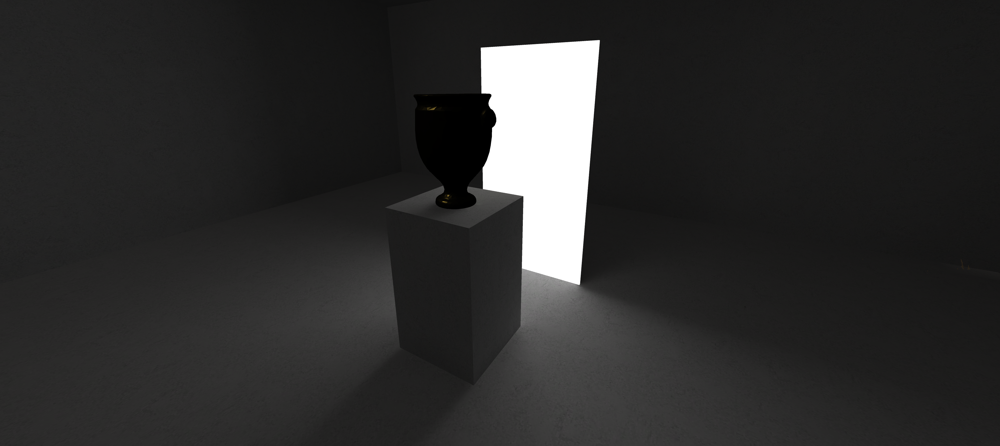

# *v r 5 (In praise of shadows)*

# (Coming eventually) Play *v r 5 (In praise of shadows)* in your browser (WebGL, desktop only)

# (Coming eventually) Download *v r 5 (In praise of shadows)*

## Description

*...*

*v r 5* was created in [Unity](https://unity.com/). **MORE TO COME** The character controller in the game is [Gold Player](https://github.com/Hertzole/gold-player) by hertzole.

## Documentation

* Read the [Process documentation](../process/)
* Read the [Commit History](https://github.com/pippinbarr/v-r-5/commits/main)
* Look at the [Code Repository](https://github.com/pippinbarr/v-r-5)

## Press

Read the [Press Kit](../press) for press information

## License

*v r 5* is an open source game licensed under a [Creative Commons Attribution-NonCommercial 3.0 Unported License](http://creativecommons.org/licenses/by-nc/3.0/). You can obtain the Unity project from its [code repository](https://github.com/pippinbarr/v-r-5) on GitHub.
