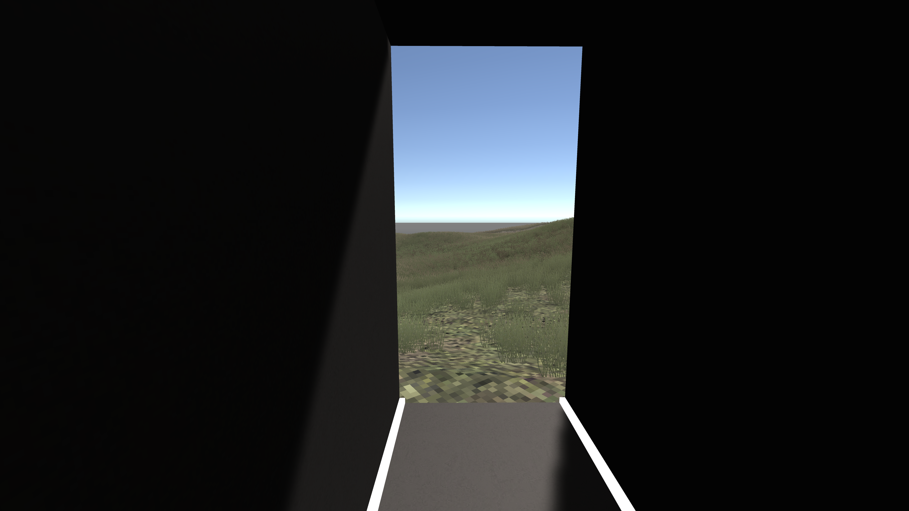
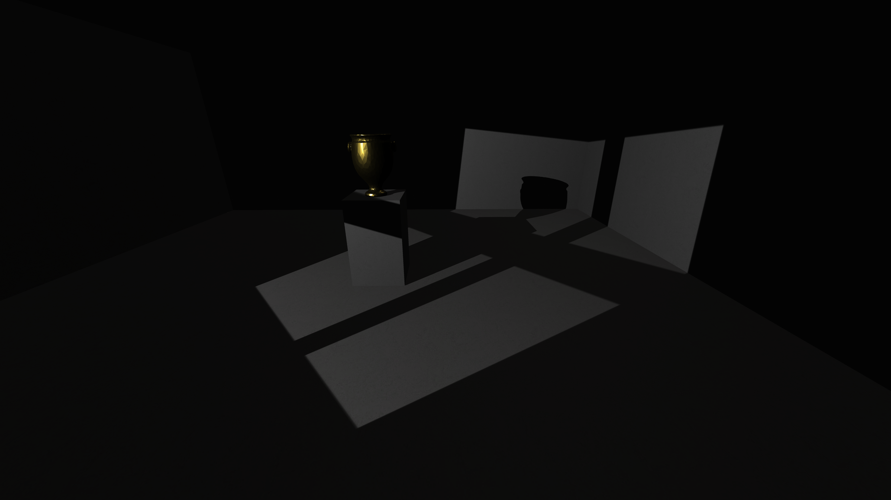

# *v r 5* Press Kit

#### [Play *v r 5* in your browser](https://pippinbarr.com/v-r-5/webgl) (WebGL, desktop only)

#### Download *v r 5* for [Mac](https://github.com/pippinbarr/v-r-5/releases/download/v1.0/v-r-5-mac.zip) or [Windows](https://github.com/pippinbarr/v-r-5/releases/download/v1.0/v-r-5-windows.zip)

#### Don't forget to take the [island map](https://pippinbarr.com/v-r-5/info/map/v-r-5-map.pdf) with you

## The basics

* Developer: [Pippin Barr](http://www.pippinbarr.com/)
* Release: tbd.
* Platform: Browser, macOS and Windows
* Project repository: <https://www.github.com/pippinbarr/v-r-5/>
* Price: $0.00

## Description

*Shadows! Flickering shadows! With hard edges! Or soft! Baked or realtime! Moving with the sun! Growing in intensity! Gold gleaming in their darkness!*

*v r 5* is an "art island" where you can explore the Unity game engine's implementation of shadows. In a series of 26 rooms, 11 sculptures, and 3 interactive platforms the island shows you the different ways shadows can appear, from the naturalistic to the janky, from making a gold vase gleam in darkness to disappearing altogether.

## History

I started *v r 5* back in mid-August 2023 starting from the essay/book *In Praise of Shadows* by Jun'ichirō Tanizaki, which I'd included as a reading in my book *The Stuff Games Are Made Of*. Tanizaki's essay is incredibly evocative about the beauty of darkness or dimly lit rooms, and thus of *shadows*. That got me thinking about how shadows work in game engines and how they (like many other elements, whether it's water or 3D assets) are generally "unseen" in many ways, largely for the crime of being naturalistic and "normal". And so, I got to thinking about another *v r* game in my ongoing series of virtual museums exhibiting aspects of the Unity game engine.

The game developed pretty naturally (if slowly) from there, with a key decision being to set it on an "art island" rather than in a building, but to create controlled environments (rooms) where specific shadows could be demonstrated. It almost certainly owes something to Naoshima in Japan, which I've never actually been to, but have seen and heard plenty about (mostly thanks to my parents).

You can see all the painful (and they have been painful) details in my [process journal](../process/journal.md) if you're into that kind of thing!

## Technical

*v r 5* was created in [Unity](https://unity.com/) (2022.3.7f1). The island topography and textures are derived from an island in [Free Island Collection](https://assetstore.unity.com/packages/3d/environments/landscapes/free-island-collection-104753). The water is the (discontinued!) ProWater from Unity's old Standard Assets. The character controller in the game is [Gold Player](https://github.com/Hertzole/gold-player) by hertzole.

## Features

* The gleam of gold in a dark room!
* A cookie!
* A very large table!
* Shadow acne!
* An area light!
* And much more!

## Images

## Credits

* Pippin Barr: everything.

## Contact

* Email: [pippin.barr+press@gmail.com](mailto:pippin.barr+press@gmail.com)
* Website: [www.pippinbarr.com](http://www.pippinbarr.com/)
* Twitter: [@pippinbarr](https://www.twitter.com/pippinbarr)
* Facebook: [Pippin Barr](http://www.facebook.com/pippin.barr)
