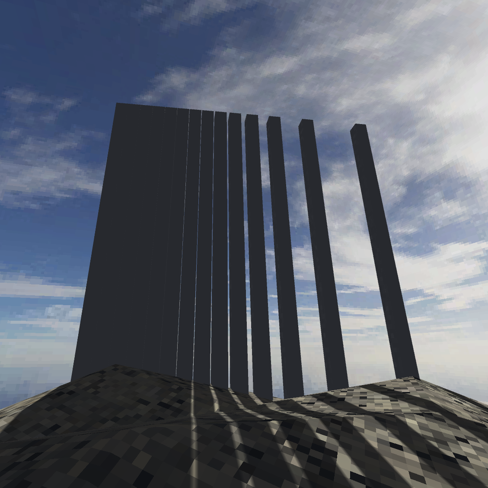
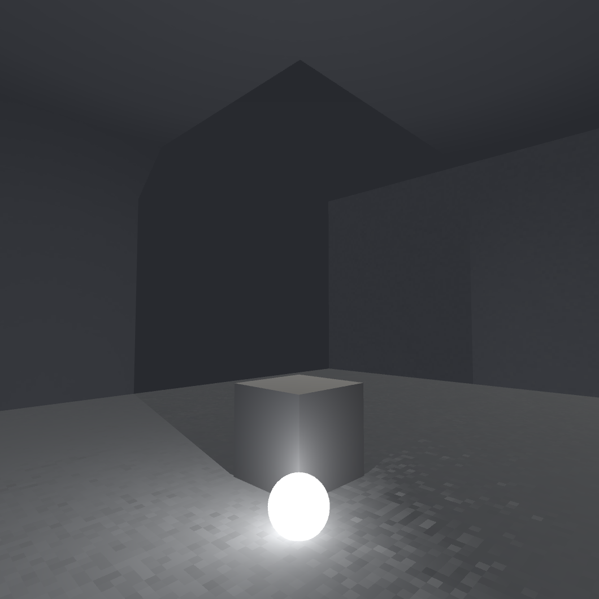
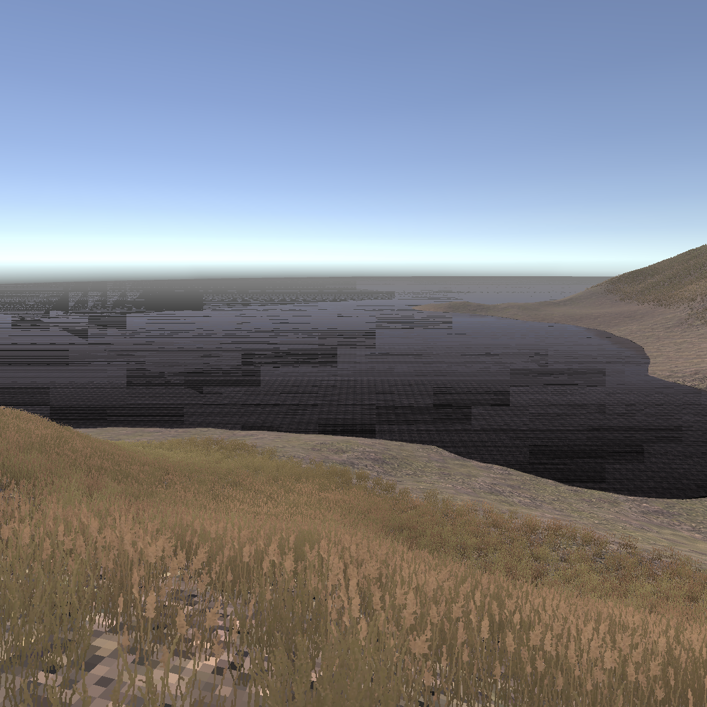
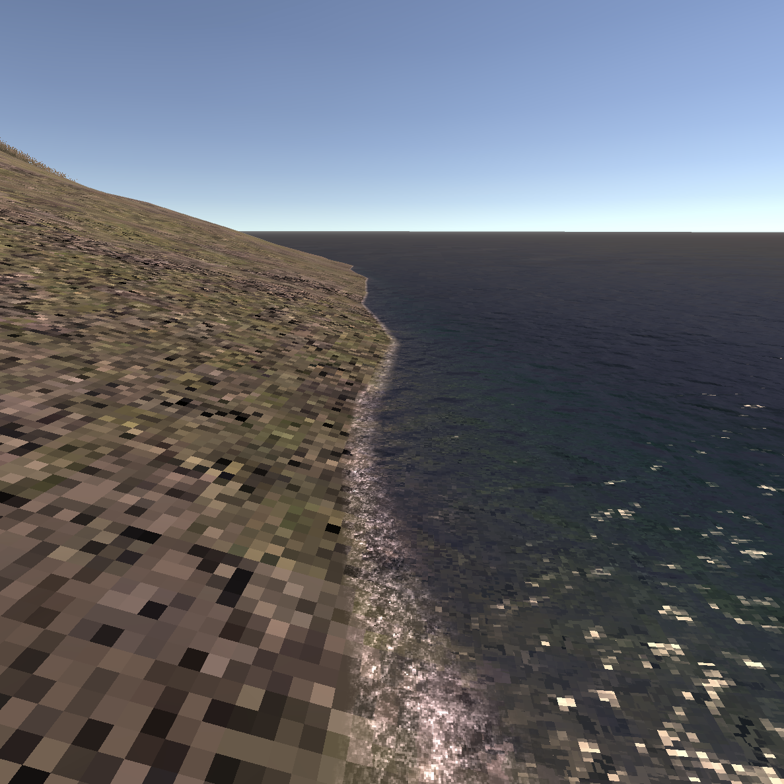
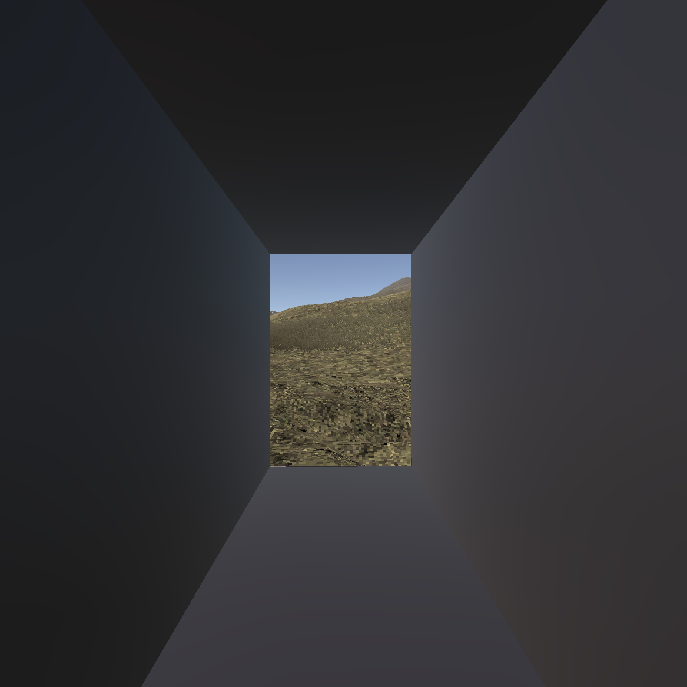
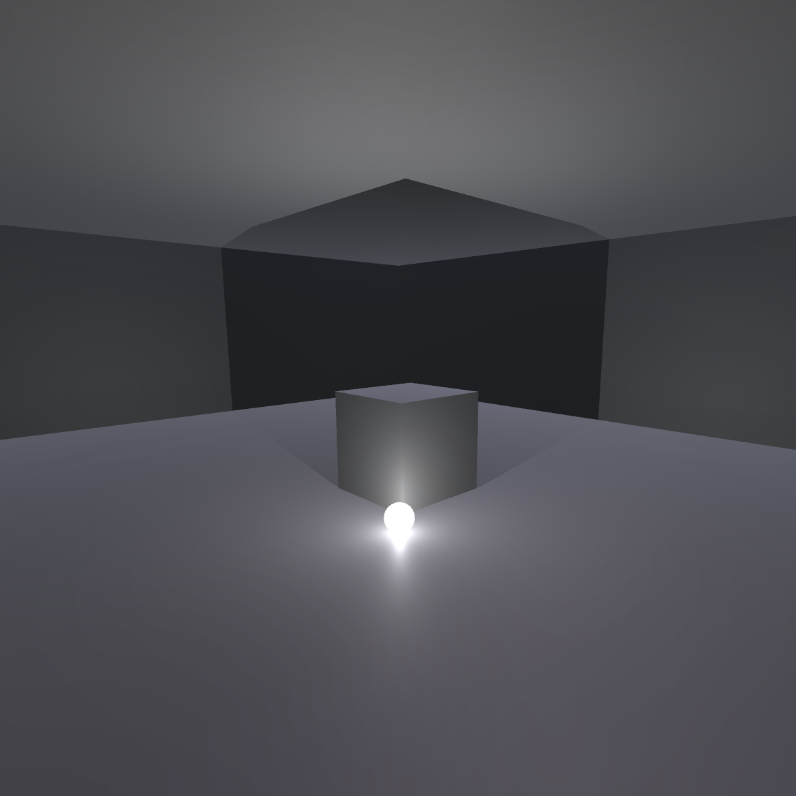
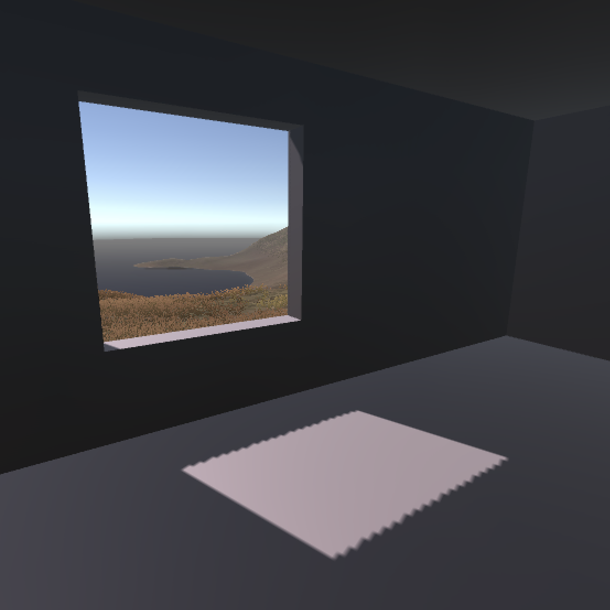
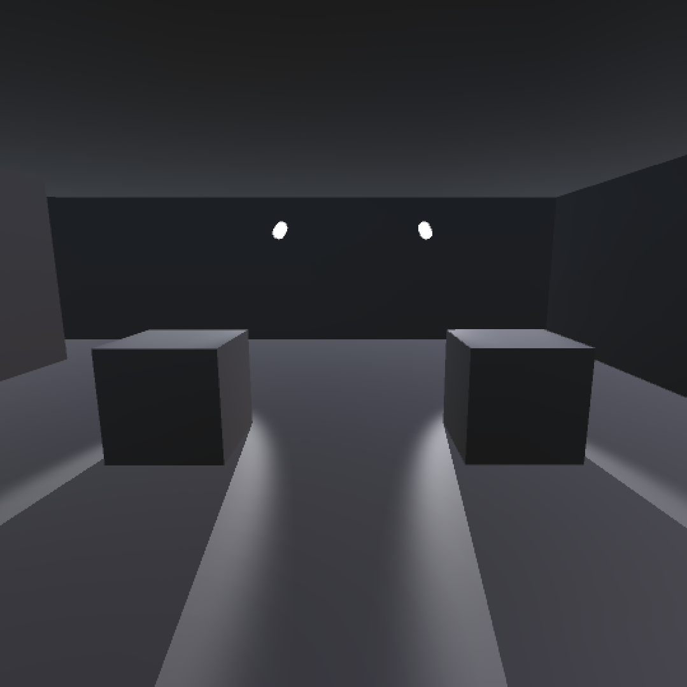

# Process journal

## Initial notebook sketches -- Tuesday, 15 August 2023

(This is a retroactive commit of the (iPad) notebook sketching I did in starting to think about the game.)

[Early sketching and thinking on 15 August 2023](./pdfs/2023-08-15-v-r-5.pdf)

## Started a Unity project -- Thursday, 17 August 2023

Well, one of the big things is just opening Unity and I can at least claim to have done that over today. I created a Unity project in the most recent LTS version (2022.3.7f1 LTS for the record), made a cube, and built it for WebGL so that there's something to see. Then built it again with a decompression fallback because it didn't want to load. Now it loads, but I observe that there is the typical irony when you don't really plan things out: there are no shadows in that first build. Because there's only a cube and nothing for it to case a shadow on. And I guess because of the angle of the camera none of the visible faces of the cube are shadowed either. So, haha.

At any rate, the project is underway. Next step is to fire up ProBuilder and hope like hell it behaves better in this build of Unity than it did when I was trying to use it in v r $4.99.

## The shitties and gritties of terrain -- Monday, 21 August 2023

I actually did some of this work on Friday too but I've been avoiding committing because the project was in such a messed up state. But right now I'll at least commit this journal and some thoughts on the current process.

Specifically, I've been interested in setting up v r 5's buildings and shadows on an island. So I grabbed a (the only easy to find) free island from the Unity asset store: [Free Island Collection](https://assetstore.unity.com/packages/3d/environments/landscapes/free-island-collection-104753) by Bicameral Studios. These are some nice islands my friend, notably enjoyed island 4, so I brough that into the game and was immediately confronted by the fact that its textures added up to around 200MB. When I built the game for WebGL it was landing at 104MB with just the island and a character controller which is... just too big.

But I like the idea of at least some sense of an organic landscape to go along with the more formal shadow stuff and the buildings, so I started playing around directly with some of the textures inside the pack, sizing them down, sizing them up, over and over again. Until I could barely understand what I was seeing. For instance here are three different resolutions of texture and normal map (as well as sometimes sizing down to lose information then back up to meet a resolution standard like 2048x2048):

I spent a while trying to figure out which was which until I realized something important: they all looked shitty.

So this morning I've gone back a step and made my own horrible island

in order to check out texturing and stuff from first principles... ish. Which meant I again grabbed a cliff texture from the island pack then downsampled it to 512x512 then back up to 2048x2048. So now the diffuse adn normal maps are both under 100KB for that one texture which is seeming more reasonable for a web download. They look gritty as hell, but I think in a way that's hopefully acceptable down the line?

So a kind of mid-res thing going on. My next step I think is to regrab the island and either retexture it with my downsampled textures (I hope this is doable as it would be the easier option) or export the height map and retexture is manually (I hope I don't have to do this).

Then I would have, in theory, an island with textures and I suppose I could add grass (downsampled?) and so on to a point where it looks inhabitable by this latest museum.

So that's what I'll tackle either now or tomorrow morning.

For the record the WebGL build of the current project (a character controller on my shitty and gritty island) is still landing at 8+ MB, but hopefully a big chuck of that is just basic Unity-stuff that's avoidable? Will keep an eye on it.

## Early questions -- Wednesday, 23 August 2023

Spent a little time this morning tweaking things per commit [8070ad9](https://github.com/pippinbarr/v-r-5/commit/8070ad9c3b371077d9fa38364af1c50f1af55aa4).

I'm roughly at a point here where I can think about moving forward with building some structures to see what it looks like. All kinds of questions to think about and experiment with

- Should the structures be labelled in some way? Especially if I use some kind of default shape for creating a "dark room" it might be good to distinguish them. But on the other hand what would it be referring to?
- Can I get some kind of a gold material going that does "stuff" like "gleaming" in different light intensities? That being one of the most memorable elements of the book - the idea that shadows serve to emphasize other things, although of course I'm interested in looking directly at the shadows themselves just as much
- You know I hate it but: baked or realtime? Leaning realtime because it's simpler and provides a constraint (and allows movement) and I think has a lower filesize? Not caring that much about realism. The only problem I imagine coming up is light bounces? To create different gradations of shadow you might need light bounces
- What am I lighting with? One extreme option would be *just the sun/Directional light* but of course I could and probably should consider rooms with point lights, spotlights, etc. since that gives us a kind of taxonomy of shadows.
- Ideas like invisible objects casting shadows could be a fun (taxonomic) idea to play with
- How involved in architecture do I want to get? Some of this process is reminding me of the Quist chapter in *The Reflective Practitioner* in terms of all the complexities and expertise of architects - the site and all that. I want this thing to look... well nice and intentional, but I don't want to labour TOO hard on that effect, so simplicity will be key.
- Moving lights? Do I want the sun to be on the move all the time, or do I want to provide buttons/opportunities to make the sun move through a cycle so you can watch the effect in specific locations?
- At some point I need some water right? (I mean I should really start the [to do](./to-do.md) list soon)
- And yeah I need to learn probuilder more fluidly - last time I used it I could only make stairs sideways and had to manually rotate them which felt... pretty stupid. Also: no grids? Whyyyy? Oh I found them. Okay I'm alright again.

So there's a ton to think about, but it's pleasing to be getting closer to building this out to try to understand what I'm thinking about here.

Probably a good step would be to literally taxonomize what possible rooms/installations I should have. So let's do that tomorrow.

## Taxonomizing shadow and light; the island as a place; structures -- Thursday, 24 August 2023

Alright, it's tomorrow.

So, I wanted to do something thinking about what is actually going to be on this island, what it means to make an island "in praise of shadows" in the context of Unity, so I'm going to think about that now.

Just a quick MDM aside: thinking about the differences between journals/todos and actual design documentation. As of right now the method doesn't really include a formal spot to characterize the design of a project because... well it's just the way I work. But I note that with *v r $4.99* I had those "curation" documents to separate out a specific kind of work. For more complex games (maybe especially more game-y games) does it make sense to have the way the game works specified out in a text, in a ... design document? Never really thought about it, but it's worth parsing through.

Anyway for now let's do some thinking about shadows+unity+island+the book/essay.

### Nature of shadows in Unity

- Lights cause shadows
- Lights can cast Soft Shadows or Hard Shadows or No Shadows
- There are four kinds of lights:
  - Directional (sun)
  - Spotlight
  - Point light (bulb)
  - Area (shape, I think only in baked)
- Shadows are created by meshes/objects occluding lights
  - Objects don't have to be visible but can still cast a shadow
- Shadows are cast on surfaces (which are terrains, objects, meshes, etc.)
  - Can invisible objects "receive shadows"?
- The shape/nature of a shadow is influenced by
  - The casting light (intensity, color?, position, angle, type)
  - The ambient light
  - Other active lights (consider interior vs. exterior)
  - The shape of the casting object (mesh, primitive, terrain, assemblies)
    - This would include settings around the smallest possible hole that light can cast through?
  - The shape of the receiving surface (mesh, primitive, terrain, assemblies)
  - The texture of the receiving surface? (I know less about this but am assuming a shadow "looks different" cast onto surfaces that are metallic versus not etc. -- this ties into the *gold* theme)
- There are temporal elements
  - Lights can move over time (rotate, translate, combinations)
  - Lights can change over properties over time (colour, intensity, shadow properties (I assume these can change??))
  - Lights can turn on and off (and can strobe, though probably avoid)
  - These "animation" oriented ideas could be looped or could be triggered
  - Should the "sun" be moving? Should it be on computer clock time? (Leaning yes to clock time as interesting, possible with additional interactions to cycle time of day, maybe even a button the user can just hold to move time along?? Or otherwise it's situated in the world at the highest peak or something)
- There are probably countless contextual elements
  - A shadow "feels different" based on what you're doing, the kind of place you're in, the scale of the space, how you entered the space, and on and on

So, these are a large number of possible effects. And of course they can easily be combinatorial - soft shadows from a direct light on a large cube that moves in a circle versus hard shadows from a direct light on a large cube that moves in a circle versus.... And I don't think the island setting is the right place for rigorous combinatorics as in *v r 3*, rather I want it to be an *experience* of shadows, and I suppose it needs to be *curated*, but I'd like it, too, to be an experience of the different kinds of shadows so that there's a chance to think about it.

### Curation, the island

So the island is "in praise of shadows" which means it needs to "show off" Unity's shadows. I want it to both provide an opportunity to enjoy shadows as they are (and as the book kind of talks about them - though in the book it's more about dimness a lot of the time?) as well as to reflect on the technical marvel of implementing shadows in an engine, as well as probably some of the comedy involved.

**Should there be plaques?** Or not? I lean not. A series of unexplained examples of things casting shadows. But it's a legitimate idea and in keeping with most of the v r games -- you say what these shadows are in order to provoke reflection especially about their technical nature. If my taxonomy were extreme enough I suppose you could just use single words to indicate the key elements being demonstrated? Or again you could have an accompanying PDF for your visit?

### Structures

One of the key ways to demonstrate shadows in specific "lights" (ahaha) is that you control the lighting environment around them. As such I can imagine wanting quite a large number of interior spaces where there is no (or very little) light involved and so can be lit specifically with particular kinds of shadows in mind.

One thought (and here I'm thinking a little bit of *The Beginner's Guide*) is to have a single room type (corresponding to that game's single door type). And there are instances of that room all over the island that all equally cut out entirely or mostly the exterior directional light so that you can focus on what is inside. Designing that space would be a very important aspect of getting started.

Along with the rooms you would have exterior installations that deal in casting light perhaps exclusively in terms of the "sun".

So next steps:

- try making a couple of structures just to check it out
- try making a base room that "does the trick" - wondering about a simple folded entryway to create potential darkness

## Size matters -- Friday, 25 August 2023

Oh how boring it is to work on build sizes, but here we are. Notably:

- I've been downsampling the textures to 128x128 and then resizing back up to 4096x4096 assuming that because the PNGs involved are still very very small (due to simple compression) it will all be good, but for reasons I don't yet understand when those tiny files get into the build they balloon from like 96KB to 5MB each. Something to do with compression obviously but deeply shitty.
- Would be great to understand if it's possible to do gzip compression stuff on github but I bet it isn't
- So then I've been literally importing my textures as 128x128 files which does lead to appropriate smallness in the build, but they're a bit blurry as I guess the default behaviour in unity for (what, the shaders?) is to blur/stretch rather than render hard edges. Can I perhaps write a shader that doesn't do that, would that work? Can look into that.
- And then I have the extra problem that the Island terrain asset I'm using seems to have a bunch of stuff baked into it such that it's like 50MB in the build which is taking up a ton of room.
- I exported the RAW data for it and then played around with building a new terrain (which I'd have to manually texture) from there, but even that seems to be pushing the build into pretty large sizes

All of this isn't that interesting but having the island settled just *feels* really important to me, which is stupid and annoying but true. Really I could (and should) also work on some of these enclosed rooms since they don't strictly need the island for testing.

I have it in the back of my mind to consider more of a low-poly mesh to represent the island but will that be smaller anyway? And how would I texture it at that point? Sounds fucking painful and beyond my skill level.

So my current worst case (which I still need to test step by step) is to build my own terrain with low resolution assets and texture it myself with the terrain tools and... well, just hope that it ends up being small. I suppose I'm "learning" something? None of this has a lot to do with shadows beyond the idea that context matters and there's a strong feeling in my soul that it's better to be casting shadows on more organic feeling territory than on something immediately pegged as "low poly".

That's it for now bud.

## Point Filter for the Win -- Friday, 1 September 2023

Been a week. As in, like, it's *been a week* in both the figurative and literal senses. Or whatever, it's been a week man.

Today, per my previous commit, Jonathan Lessard managed to save me serious trouble/sadness by pointing out you can set textures to use a "point" filter which means they scale based on nearest-neighbour or whatever, preserving hard edges and that minecrafty look we know and love. So now it's become possible to use my 128x128 textures, scale them up so they're less repeated-looking, but to keep them crispy instead of blurry. The result being that I think the island looks pretty nice and it's exporting at 9.2MB textured (though not textured well enough yet).

A next task is just figuring out how to texture (and detail?) it well enough that it looks kind of busy and alive and as much like the original Island pack as possible, while being substantively smaller. I wonder now whether I can also do the point filter thing on the detail brush things as well, probably? Good if so.

Anyway I have some hopes for the island at this point and getting a build that maybe ultimately is under 20MB or something? Is that realistic? I really don't know, probably not but still we've made some serious progress at this point.

So: more texturing is next, followed by returning to trying to probuild some buildings sensibly.

## Textureman, textureman, doing the things that a texturecan; also Discard Changes -- Tuesday, 5 September 2023

I don't *seem* to be able to convince Unity to "just" use the original Island in a low-size way. Wait I'll try something quickly...

I am trying to use the new point-filter thing to convince the "cool island" version of things to be smaller - let's see if that works to drop down the texture siiii... nope.

So the situation is that I'm starting my island "from scratch" by

- Starting a new scene
- Creating a new terrain
- Importing the RAW exported heightmap of the Island terrain
- Lowering its resolution
- Making it smaller
- Downsampling all the textures from the Island pack to 128x128 files
- Using the point filter so that they don't blur when scaled up
- Texturing the island ON MY DAMN OWN to try to make it look convincing enough (this is hard)
- Eventually putting detail objects on there as well for more visual interest/complexity

I even made these two images (one is the original island one is mine) to try to figure out areas where my texturing deviates (always assuming the people who made the original Island are texturing geniuses etc.)

Also noticed that of course you can get very visible "mixels" in this new environment, e.g.:

Here the concrete texture has more pixels per whatever, a higher resolution or a lower tiling rate or WHATEVER THE LINGO IS.

Should everything match in terms of that? Or is the mixelling telling us something worthwhile? Unsure and I will try to look at both at some point.

### Discard Changes

Also a quick MDM note: I've been noticing that a frequent flow at this stage of the project is to try out some tech solution (e.g. all my to-ing and fro-ing about how to get smaller builders, interestingly crunchy textures, etc.) find that it doesn't work at all, and then Discarding Changes in VS Code to get rid of the evidence. *Should* I be including every step in the repo? It doesn't strike me as an interesting part of the process, just trying to settle very fundamental tech issues, and I *am* reflecting on the process in fairly fine-grained detail here in the journal, so I think the "thinking" part is still there. The bit that's not there is mostly just dissatisfying results in the unity build that don't necessarily communicate much and might just "take up space" in the repo.

But I dunno - should I be a pack rat and KEEP IT ALL?

## The grasses blowin in the wind -- Wednesday, 6 September 2023

Spent my time this morning on the grass details which are a key way to add some visual noise that drowns out the repeating textures among other things. Did a couple of quick experiments around just dumping a ton of grass on the island and exporting to see how it impacts build size (it doesn't really).

Then tried to more carefully place the grass relative to the underlying textures (no grass on rock, less on the bare dirt, more on the green, blending the grassy grass and the more reedy grass relative to where we are on the map).

Then ran into the draw distance for the details meaning that the grass is constantly "teleporting in" as you walk which looks distractingly stupid, so found the setting to essentially make it always visible.

Then ran into the fact that because the grass colour is a bit different to the terrain palette the grass really stands out too much so I spent time working with the underlying image files as well as the tints Unity applies to get something more naturalistic. Compare this before and after, which I'm somewhat proud of (and which also includes the draw distance setting being ramped up now that I look at it):

So there's still a little bit of work remaining here, but the island is *starting* to look kind of how I want, which would mean I could start construction, haha, but yeah construction. Helpfully, but making it to this step I could probably feel comfortable doing some exterior shadow stuff that's designed just to work with the sun, casting shadows on the ground, which is somehow less intimidating that the interiors for now.

## The first dark room -- Monday, 11 September 2023

Dear diary, I finally made a dark room. The island itself seems to be in sufficiently good condition that it felt time to move over to shadows.

Actually, in the weekend I was showing it to Felix as well and we made a really tall square pole kind of object and I was then stunned by how long its shadow was going downhill - hills and shadows eh, who knew.

But today I finally overcame some of my ProBuilder fears by realizing I could make the floorplan for the room shapes I've been thinking of just using extrusion techniques. And that word "floorplan" makes me think of the fact I did a bunch of drawings last Friday on that subject, so let me get them in here too...

[Sketches from Friday, 8 September 2023](./pdfs/2023-09-08-v-r-5.pdf)

Those sketches mostly are about consider audience flow through interior spaces (one door or two doors?), the whole thing of framing a view when you exit, questions around how the buildings and the terrain interact (terraforming versus stairs versus careful positioning) and the general point of having a place you can stand that moves the sun in the sky.

Actually while I was lying in bed I was thinking of the sun in the sky and thought it could be nice if it moves fast when you stand on the thing, but then stays where you set it, so it's a kind of somewhat laborious ability to change the time of day? I quite like that.

(I should start my to-do list now or I'm going to get confused. There.)

Going on from those sketches of floorplans, as I said, I finally used ProBuilder to make a sample room, which ended up like this:

Which is to say I did manage to get a room that's a reasonable first draft of a setting to observe a shadow in a more or less controlled environment. A few things on that process:

- Turned out I had the concrete material set up to me super metallic and I guess shiny so it wouldn't let the room be dark (I guess simulating the idea it would just bounce around the light from the outside?) - turning that down was the big difference maker to make a dark room
- Started wondering what relationship the shadows have to bump maps
- Re-remembered that when you make a point light it doesn't automatically cast shadows; and of course worried about performance implications with lots of lights (and then thought about - in the commit message - the idea of lights that only turn on as you enter, which has a pleasingly physical relationship to shadows?)
- I'll need to remake the room because it has some gross seams that - yes that's right - cast weird little shadows and make it totally clear how shonky my work is on that front -- I'm more confident I'll be able to get this working though
- Really love the contrast between inside and outside at this point, very neat, and that transitional moment (oh and now I'm like... what about that weird light effect you get passing from dark to light? Probably could figure it out but maybe not)
- And of course is this about shadows or light?
- Oh and the need to make a gold material to play with
- Shadows on grass
- Shadows down hills
- This is going to work

## Space and architecture -- Tuesday, 12 September 2023

This morning I was able to spend some time quietly brushing heightmap details onto the terrain in the "bald patches" of rock and dirt so that you get a little more visual interest. Not entirely sure how important that is, but did run into some shadow-stuff where I'd accidentally create a more drastic shadowing effect on the terrain than intended and then would fight with it. I wrote a bit about that in the commit and the whole terrain casting shadows on itself thing is clearly something to note.

After doing that I happened to zoom upward and then realized it would be smart to take a look at the layout since I now have two prototype buildings on the island that give me a sense of how much room there is/isn't for the buildings (and other structures) on the island, so here's the image of that:

Well, so it feels like there's a good amount of space for combinations of buildings and other installations, as well as to just let the "land be itself" as well - don't want it to be totally cluttered.

As I think I've already mentioned there's a whole correspondence to the Quist stuff in Schön's *The Reflective Practitioner* where these buildings are of course going to be "in conversation" with their setting. For my level of sophistication (low) it will be a pretty dumb conversation where I'm just trying to make them sit right and look non-stupid. It's currently my intent that all the buildings would be "the same" (maybe with small mods like a window if that's the idea etc.), but I wonder how boring that gets and how much that causes trouble navigating.

Which also brings up questions of labelling and wayfinding - do I want a map? Do I want to number or letter or something the buildings to distinguish them?

But yeah if all the buildings are the same does that kill the mood a bit? Or am I just making myself trouble? I suppose to the extent that I become "extremely good" at probuilding this kind of simple, brutalist, concrete form building I can make custom ones as it pleases me - maybe even "in conversation" with specifics of the landscape.

I know there's a "make holes" in the new terrain stuff I haven't seen before which opens up the possibility of

- Buildings set into cliff-faces perhaps (that museum in Tasmania?)
- Actual caves (I brushed past a reference to Plato's cave the other day which is obviously a major "shadows" reference as well)

So I suppose I want to say here that it has been very generative spending some time with the terrain even though my initial thought had been "grab an island as is and chuck stuff on". I've enjoyed learning the tool, it's been very satisfying building something "of my own" (with inherited components from the Unity Store Asset), and there's a lot of "shadow stuff" involved that I might not have realized so easily otherwise.

In short, project continues to go well in these dribs and drabs of time I have. Next up it probably returning to probuilder and trying to make a non-seamful room.

## Shadow acne, 5 o'clock shadows, shadows everywhere -- Thursday, 14 September 2023

Just wanted to drop in after the last commit to reflect a touch on the whole shadow acne issue. Specifically, was reminded (by seeing it) of shadow acne and how it happens and how you can attempt to control it most of all with the bias settings on your shadows.

But everything has knock-on effects, and everything is extra meta because at base the game is about shadows and... well *whatever* the shadows are doing is still very much a reflection of shadow technology. It's just that in making a nice looking island and working on clean-looking brutalist rooms for things I've inevitably become attached to the shadows looking "nice" rather than... whatever, just "the way they are".

Because if your bias is low, then you get shadow acne and thus the walls and surfaces look really pretty weird and gross. That remains a *consequence* of shadow acne, but still.

**BUT** that does make me think: well, you could literally demonstrate shadow acne in one or more rooms right?

**AND** in the same way you could demonstrate the bias value in another room, the way casting shadows can be radically changed. Bias and normal bias too.

**BUT** that starts to get very inside baseball, very parameterized (v r 3-ish) and I begin to wonder how to *explain* that? Informational plaques that try to give you a sense of the point without being too detailed? I suppose so.

**AND** as above, too much bias leads to "peter panning" where objects appear to float because their shadow detaches from them (that's what the bias does), while too much normal bias leads shadows to be ridiculously small and weird.

And **NONE** of that looks naturalistic. And I think one of the problems I have with that is I'd like the exterior environment to look kind of "normal" and to keep the freakshow experiments inside the rooms in more controlled environments?

So I also experiments with *hard shadows* outdoors which seems to reduce the artifacting stuff a lot without compromising (much?) on bias?

And also while I was reading about these problems on infinite forum threads I was reminded that of course there's also the whole universe of *baking* the lighting which means baking the shadows too, which might be a way to save a lot of heartache if (a) I could ever fucking figure out baking this stuff and (b) it doesn't blow the size of the game to hell for web.

Which **ALSO** is a thing because the behaviour of all this in WebGL is *another* issue that appears separate. For instance when I "solve" the acne with hard shadows and a high resolution shadow map for the real time shadows, the WebGL version still exhibits what looks like a tiny line of texture fighting at the seams of the building. Maybe I can beat that with vertex welding? So many shitty little things to think about.

And again I stress that this is also funny and maybe an *opportunity* because it's **NOT MY FAULT** that all these things happen: **THIS IS THE TECHNOLOGY AT WORK** and to some extent **THIS IS WHAT I AM EXHIBITING**. I thought it would all be beautiful and "aesthetic" but maybe I will also be demonstrating how shit things kind of can be?

So a frustrating, sort of funny if you squint, situation.

## The fight continues, now with Blender! -- Tuesday, 19 September 2023

Well I am still trying to figure out a way to make the room work in WebGL because the discovery over the last couple of days of fiddling has been that it might render perfectly well in the editor (and maybe in an application version? will have to check) but in WebGL there are other troubles.

The most troubling trouble for right now is that when I put a (separate cubes) roof and floor onto the walls of the room the seams are visible in WebGL - though not in the editor (and maybe not in the app). I cannot for the life of me understand why. Is it a texture thing? Is it an "edge-fighting" thing between the meshes? Do I microposition them separate? Do I then run into some other bullshit? Is "edge-fighting" a thing...?

Well no apparently, but I've read plenty of stuff maybe suggesting that my geometry sucks, which hardly surprises me. It would be nice I suppose to understand how to combine the whole thing so that the vertices etc. are all rational or whatever.

I also can't understand (well enough) how to do the UV unwrap so that texture sit on these things correctly, but I suppose that's for another day.

And on top of all that shadow acne is back in WebGL probably because of some other setting I added perhaps to do with the hard shadows or other stuff I was doing to try to solve ... shadow acne. Fuck me.

Here's an image:tThe left building is blender, the right is probuilder, shadow acne on both at a certain distance. Whee!

In amongst all this and as I think I've remarked but haven't yet dived all the way into reflection-wise, is the ways in which all of this (well maybe not the UV unwrap and the seaming) *is* a part of how Unity renders shadows - what shadows "are" in the context of this engine. Shadow acne *is* shadows. That is, it's a reflection of how the engine tries to render shadows - yes it's "wrong" in the sense of not being naturalistic, but it's also "right" in the sense that it's the engine's idea of shadows in these circumstances. So...

I mean I think I have to have shadow acne as a part of the project, in a room or illuminating some specific element outside. And because it's quite a weird technical problem there needs to be an explanation. And that means I either need in-world texts (avoid?) or a PDF (easier, funny) to explain some of this stuff to the viewer.

And it also means that I need to let go (somewhat) of the idea that the island and its shadow will be by default *beautiful* as in the essay that inspired the work (In praise of shadows) and maybe I need to remove that from the title for that reason. It's more about "in reflection on shadows" or something along those lines right because we're trying to see the shadows as the engine understands them, not in some "artificial" (ahahaha, this is so weird) way where it's only about naturalistic effects. It's all about engines and realism and shit.

## Oh, WebGL, why are you stuck in your teenage years? -- Wednesday, 20 September 2023

Well I'm making progress, per the commits, but it's been a long road to some kind of sense of being able to "begin construction" in terms of placing stuff on the island and thinking about the room-scale installation pieces.

Importantly, in switching to Blender for a while and reading stuff about 3D geometry I was able to understand that my problem was emerging out of having mismatced vertices/edges in the earlier models that led to the weird seam effect. I still *do not know why* but I know *that*. Thus I started rebuilding the room thinking with "edge loops" that essentially helped me to make sure I had matching vertices where needed. It looks like this:

In principle I think this could allow me to return to a modular structure, but for now I just have the room as a single unit. Interestingly (?) this does make for an experience where I have to install/experience the curation of the interior light works from inside the room - no lifting off the ceiling and floating on high. On the one hand this is going to be cramped and inconvenient, on the other hand I kind of like the reference it gives to really doing this in person and the kinds of perspective you're forces to have -- a classic tension in making games versus playing them in terms of how you're situated relative to the world, god or person.

Having done that I was able to translate the Blender stuff back into ProBuilder (edgeloops are there too) so that I can again make the room in ProBuilder, which I feel more comfortable in. And hey presto I do have a room that doesn't show those cross seams.

BUT the new fun shitty thing is that the room (and all meshes) have heinous shadow acne in the WebGL builds, like this:

Edge-loops can't save me now apparently. Note that this acne does *not* show up in the editor. Haven't exported an app version but I'm willing to guess it won't hit there either. To which extent there might be a quality setting I can try to force in WebGL that might ditch it? Alternatively I imagine it could just be back to the drawing board with bias and hard shadows stuff with the idea that I can find settings that work in the WebGL build (I suppose I could even just have totally different build settings on that front).

And of course it's a continuing reminder that the shadow acne looks kind of cool and Moire-ish. And that I'll want to do that on purpose. But I ultimately want the exteriors to have as little non-naturalistic lighting and shadows as possible as a default. I like the unnatural stuff to be at least somewhat under my control. Control control control.

## Fuck you webgl / Settings mania -- Thursday, 21 September 2023

I just want to jump in very briefly to say that it has been really hard trying to understand WebGL in particular relative to shadow behaviour (and probably other stuff but I'm fixated on the shadows for obvious reasons). I spent a bunch of time today, but also just over the weeks(?) I've been doing this trying to figure this out. I of course thought initially when I got it looking alright in the editor all was well, but also of course no - webgl is a different animal and that's the limping impala I need to care for in my game engine animal nursery.

Anyway just wanting to remind myself of and give a sense of the sheer amount of research and failing one does in these situations. Things I have looked into at some level as a potential help when trying to understand how to make webgl look alright (haven't tried all of these, it's ongoing)...

- **The camera's far clip plane** - somebody somewhere said that might help, but I don't really see why. Obviously you wouldn't end up rendering shadows in the places where the world doesn't exist, but it doesn't make sense to me this helps anything shadow-wise...
- **The shadow distance** - more likely in the sense that it's about how far away shadows render, and I've seen some oddities if it's super far where the terrain gets really inappropriately shadowed in flashes so I guess there's something going on with this one. If you set it small enough you don't get the flickering simply because you just don't see any shadows, but I really do want shadows visible at some distance because... well I guess *seeing shadows at some distance away* is part of seeing shadows.
- **Shadow cascades** - actually nobody suggests this is an issue but I also have no idea of what they are. What are they? Let me find out right now... okay it's about using different shadow resolutions based on proximity to the camera, which makes some sense. The default seems to be four cascades (four different sets of resolutions).
- **Camera-relative culling of shadows** - Unity's manual claims this reduces shadow flickering but I haven't the faintest idea if that's true. I turned it on and didn't see much of a difference.
- **Bias** - Yes good old bias is a major one for reducing acne but I don't think it seems to be helping with flickering or distance-acne? There's bias and there's normal bias. And of course if you set them high the shadows look ultra-fucked in a different way (detached and totally unrealistic) so it's not an amazing solution. But avoiding up-close acne is important it's true.
- **Shadow map resolution** - I assume this is about shadow crispness? Would this be about flicker - hard to understand. I set it as high as possible assuming that would be best, but of course setting things high isn't necessarily good since it can impact performance in non-performant platforms like... webgl.
- **Render pipeline** - I started using the default rendering pipeline but read at least a couple of people saying that the URDP which is, what... Ukrainian Revolutionary Democratic Party... no... it's URP which is Universal Render Pipeline... which I think is just... newer? Some people have said it didn't work in webgl, some people have said it did. Can you change rendering pipeline midstream? Perhaps I will find out.
- **Hard versus soft shadows?** - I assume hard shadows perform better but seem like that might be more vulnerable to artifact stuff? I don't know. I had thought hard solved some big problem I had, oh maybe it led to not needing high bias, but then that wasn't true on webgl? I forget.
- **Shadow reflections** - I don't even know what the fuck that is, but it's a setting. Maybe it isn't? I feel like I have seen it somewhere.
- **Quality settings in general** - There's a whole thing of whether to try to force webgl into a single set of quality settings to control what's up, versus that just breaking on various platforms. It's totally possible plenty of settings not obviously named after shadows or camera or light-specific stuff still have an impact (anti-aliasing??)
- **Colour space** - I think somebody mention going from linear colour space to gamma or something and it helped but introduced other problems
- **Distance from world centre** - The idea that shadows and stuff are centred on 0,0,0 I guess? Is my terrain/island centred there, could that help? I should try that. Unity also helpfully suggests just shrinking your world to make it easier on the engine but what does that do to other stuff I wonder? If everything is half as big what kinds of knock on effects are there?
- **Temporal antialiasing** - Don't even ask me what that is. Somebody mentioned it and I think it's some sort of addon.

So there's a lot and of course these things all potentially *interact* so it can be *very* hard to know if one thing is making a significant difference.

And there are plenty of other things I fiddle with I'm sure but I'm just trying to give an honest profile of how much scrambling is often involved in this kind of work - compromises, failures, realizations, re-realizations, crushing realizations.

Here are a bunch of links to webpages I read while thinking about this and trying stuff:

In the end I have *something* going on? Like it's not painfully shit?

- <https://community.gamedev.tv/t/info-common-webgl-issues-and-how-to-fix-them/58841>
- <https://www.reddit.com/r/Unity3D/comments/griwnj/urp_and_webgl_shadow_is_blocky/>
- <https://forum.unity.com/threads/which-renderpipelines-work-with-webgl.1207846>
- <https://forum.unity.com/threads/webgl-lighting-tips.1092832/>
- <https://www.reddit.com/r/Unity3D/comments/p5nhs8/does_anyone_know_why_my_shadows_keep/>
- <https://forum.unity.com/threads/directional-light-shadows-flickering-issue.672094/>
- <https://docs.unity3d.com/Manual/shadow-distance.html>
- <https://docs.unity3d.com/Manual/LightMode-Mixed-Shadowmask.html>
- <https://docs.unity3d.com/Manual/UnderstandingFrustum.html>

You know? Now you know. Anyway I'm just being honest here, this is what this work looks like sometimes and it can be hard to capture in documentation because it's just such a frenzied screaming rush of infinite websites and parameter tweaks you're obviously not going to repeatedly commit.

## Real Gaps and Real Lights -- Monday, 25 September 2023

Spent time today biting the bullet and trying to "start". After a brief dalliance with and then backing away from the URP I tried to make a couple of ultra-simple exhibits. That is, first of all

A series of poles with a decreasing distance between each one (half as much each time) until you no longer see light passing through them. In retrospect I wasn't quite as scientific as I'd like with their positioning relative to the sun (they really need to be precisely perpendicular to prove the point). But generally speaking the idea being that there's a moment where light stops passing through gaps in Unity and therefore what's on the other side becomes shadowed despite there being optically a gap for light to pass through.

And second of all a room with a cube in the centre (well, by eye and this is of course making me think about how I'm *not* easily hable to measure to the centre and perhaps I should figure that out? A little marker?). And a pointlight on one side that casts a shadow into the corner of the space which create a sort of shadowcube based on the way it falls on the corner's structure. It's not something I was actually looking for but just came up when I placed the light and moved it around, so I'm happy about that. It felt like a mini-Turrell moment?

In doing it, as I mention in the commit, I decided it would make sense to give the light a presence in the space by creating an emissive sphere to show where it's casting from - it just makes things more legible and is quite satisfying visually.

Having made a sort of start like this I'm immediately conscious of the potential need (or no need?) of a sort of taxonomized approach to all this versus just going with more impressionistic interactions with the shadow system. Like there are things I do want in there, but do I need to really measure it out closely? But if I do that I don't know how possible it is to maintain... like the directionality of a shadow makes a difference - the corner versus a wall versus "just" the floor and on and on... to such an extent I don't know that it's going to make sense?

Alternatively though will I simply run out of ideas? Pretty clearly I should take a beat to start mapping out what the installations and rooms I might "need" relative to the properties and nature of shadows in Unity? Yeah probably that's what's next. Plus there will of course be discoveries along the way (like my Turrell cube or the Very Long Shadow down a hill).

## Building buildings -- Friday, 29 September 2023

This week I've managed to actually start a pretty comprehensive [list of works](./list-of-works.md) and work on some of the simpler ideas around interactivity in the world (diases you stand on to affect the sun). Overall this has made the project seem pretty doable.

My current concern/annoyance is around the (non)modularity of the room, which I think I should try rebuilding in multiple pieces (notably at least ceiling an floor?) in order to be able to manipulate the dimensions a bit more easily. Just now I was trying to see whether I might be able to simple select one end wall and the pull it to make the room longer, but it hasn't felt very achieveable and I suspect I'll want flexibility both for the purposes of different display types and to just avoid a kind of monotony with the forms on the island?

It's not *quite* easy enough to "whip up a room" every time I need one I think? On top of this stuff though I'm a bit unclear on whether just having better-matching geometry might have solved all my prior seam issues... in which case is there some cute modular way to make those rooms out of pieces and not ever worry about building them by hand?

How much should I let this bother me? I quite like the idea I wrote somewhere of also just changing the architecture a bit as I fancy, having sloped roofs or high ceilings or whatever... like it would be nice to be architecting a bit?

And are there better ways to contruct something like this? Like it's better to subdivide and make holes and stuff?

Also just aware of a tendency to maybe try to find imperfections and problems to avoid construction. But also aware that if you jump into construction you can find out quite late in the game that it would have been way better to do things another way instead of the shitty way you did them.

I guess the big questions are

- Bespoke buildings (could be fun and I suppose I'd get better, but it's conceivably this adds weight/size/meggage to the project?)
- Kitset buildings (if I could figure that out? It would require all the matching vertices stuff which is non-trivial?)
- Just one building, or maybe like three or four kinds of buildings and I could conceivably tweak them just a little bit as needed? Like an L building, a square, a longer one, that kind of idea?

I suppose having just written it I lean toward the idea of a small set of repeated buildings. Totally bespoke may just lead me down the path of trying to become an architect which I am not.

## WebGL water, shadowplay, kitset? -- Wednesday, 4 October 2023

Yesterday I managed to poke away at the game during my programming course's studio time. Actually I also showed the class some of the (very simple!) programming in the game as it stands to try to give them a sense of the parallels between something like JavaScript with something like C#. But I did find out why the water looked like this in the WebGL build initially:

It was because of some material assignment stuff. I played with a good number of other things first, but the the thing that fixed it was noticing that the water's plane had two materials assigned to it, leading to some kind of texture fighting I suppose? Anyway, when I deleted the second material I got back to this:

Weird the problem didn't exist in editor or application, but maybe it's just smarter about that situation for some reason. Anyway, now the water is actually established and I don't need to fret about that aspect of my fancy naturalistic environment.

I also switched to Unity's default skybox because it bugged me that the sky didn't darken when the sun when to nighttime. It's now as nicely pixelly now but it does respond. If I have the energy I can look into making a reactive skybox that has my beloved pixels. But realistically I dunno because as soon as you have a cloud or something (that shows off the pixels) you're going to expect the clouds to move if the sun moves and then you screwed. I suppose I could have meshes for clouds, but that's... well actually the shadows of clouds moving across the terrain would be kind of rad? Uh oh. Well I'll think about that.

The other thing I did was play around with the spotlight idea, having a dias that turns on a strong spot. Spent quite a while feeling it didn't work (didn't seem to cast a shadow of my building) before realizing the shadow was getting washed away by the sun light source. So there's that aspect of shadows too... a shadow for one light can be cancelled out by another light. Which is kind of interesting really and probably worth demonstrating? The vulnerability/dynamics of shadows?

I'm feeling a bit of inertia in the project right now and it's almost entirely because of the dragginess of building rooms. I'm wondering again about going modular and what that might take. I could even look at that BBlock kit I used v r $4.99? Like could I make a little "easy to use" set of walls, floor blocks, door blocks, window blocks, and just clip togeth a room? What happens to the texturing in that situation? Will it matter? Maybe I will try this out today.

## Death to kit sets -- Thursday, 5 October 2023

Spent most of my allotted time today desperately trying to be clever about creating reusable pieces for constructing rooms, even to the level of giving them edgeloops and stuff that was meant to make it easier to align vertices. But noooooo, it was not easy and it did not work. I was quietly confident but there were weird texturing issues, texture fighting, seamy stuff, and so on. So... fail.

It's probably possible to do it that way, and I did read some stuff about this process online, but I was never able to truly understand it.

To which end it looks like I need to do something like:

- make one or more original buildings (e.g. a square, a long one, an L one)
- Use them repeatedly to create some level of variety
- Edit individual instances of those buildings to give a little bit of visual change-up like slanted roofs, or bevelled doorways, or whatever else might be fairly easy to do
- Explore embedding a building into the terrain as well, seems a cool trick and I'd be keen to see it

So time to brush up my probuilding obviously, but I think even from the last time I probuilt a room it wasn't all that arduous once I was on the trail of edgeloops and stuff to avoid the seam stuff, and by keeping it all in probuilder out of a single shape (extruding etc) I'm then able to keep the texturing consistent. Could also be trying to do all this in blender but I don't see the need.

So this project has definitely been a ton about hitting my head against 3D geometry, but that does make sense since that's the stuff that... casts shadows.

## Molasses -- Wednesday, 18 October 2023

Definitely a bit molasses-y with the game for the last bit... kind of shocked/depressed to see my last journal entry being two weeks ago, though in terms of commits etc. it's been more regular than that.

In essence I've continued to get caught up in the building game. But with the upshot that I *think* I've made a few decisions that will be helpful long term. Specifically:

- I'll be damned if I can figure out how to make a nice L-shaped structure, but also: fuck that structure. I was only going to do it for variability of shapes and I think I can do that in different ways...
- ... like instead modifying some of the exterior details of the basic rectangular building which I've found out I can manage mostly without instane artifacts (light leaks especially) by duplicating faces and then building extrusions etc. from there, leading to what I hope will be nicely varied structures.
- I have become good *enough* with ProBuilder to at least easily alter the dimensions of my rectangular space, which might well be good enough. Tall ones, flat ones, long ones, square ones, and then with external "flair" it should be good enough.
- That approach also means I can essentially just install everything in totally vanilla rooms and just modify them later as needed, or as I realize the building dimensions need to change to meet the requirements of the install in terms of stretching or shrinking

Anyway, I'm claiming in this moment that I will simply stop trying to be fancy and will instead focus in on just using the building I have.

ALTHOUGH, one big proviso: fucked if I can figure out how to make a window? Oh well.

## Let's get this party started sometime -- Tuesday, 31 October 2023

Wow I've let a lot of time go between journal entries, which I guess partly tells you that I've somewhat been spinning in place. Or perhaps at least spiralling outward in place? I do think I've managed to do and learn a lot in the interim (see commit messages) but it's also true I haven't really advanced anything visually.

Consider that I took a couple of screenshots today to show the current state of progress:

Which... well it's progress in terms of the ways in which behind the scenes the room was made in Blender and appears to sustain 0 bias nicely, or how it's prefabbed with entry and exit triggers tied to the lights, or how I tested probuilderizing it and extruding some of the surfaces successfully.

But it's also just hilarious that these are pretty much the same two screenshots I posted in late September. So a month of battle with 3D modelling, UV unwrapping, the lighting system in Unity, prefabbing, and more. But... I kind of feel like I have, finally, come out on top?

To which end there's no reason at all not to start the install. Fingers crossed that is true, because it's starting to feel like I'm satirizing someone who just can't quite get started on their project.

## Production Mode === Question Mode -- Monday, 6 November 2023

Okay well I *did* start the install process as you will see from the commit subsequent to that previous journal entry. And as you might imagine when the rubber meets the road and when the hands get amidst the materials of creation and the shadows mingle... it got complicated almost instantly.

The windowed room was not so complex:

But it turns out that spotlit cubes led me down a path of understanding pixel lighting:

To quote the commit message:

> Anyway it just feels like there's some stuff opening out and I need to keep my eye on the prize of making it an interesting place to *be* rather than mostly focused on my own internal noodlings with the engine. So I still want exhibits that show what's what, but I don't want to get into the weeds on invisible things, or unperformant things, or etc. Okay? Okay brah?

In essence there are a lot of things about the engine itself and how it works that are interesting from one way of looking it (like a maximum number of pixel lights per surface/mesh) but are probably just *not that interesting* to a person visiting this island.

So what do they want? Well nothing much specifically but mostly to look at things that are... interesting, surprising, beautiful, poignant? And that in combination with my almost educational-orientation yields the game. Do I want to "teach" them that you can only have two pixel lights per mesh? I think probably not right? That doesn't sound very interesting even if it probably *can* be in some way...

So I think probably a little revamp of the work list in this light, trying to think of cohesive displays that show something but are also just aesthetically worth seeing in in order in this situation.

And for the moment: no more than two lights on in a room, basically. And it's probable I can achieve most of the stuff I'm interested in either by literally only having two lights in a room, or by setting up such that only at most two are *on* at any given time, though there could be more.

And the ongoing question: will I fill the island? Will I *over*fill the island? No fucking idea. Also what happens to the fil size when I have a lot of different buildings? Also... don't know.

But for now a revisiting of the work list given new technical info and perhaps a mind more ready to do further installation having tried some stuff.

## Failed tunnel -- Thursday, 9 November 2023

A quick entry to document some invisible work. I spent some time this morning building a tunnel through the "mountain" in the centre of the island since you can delete individual terrain tiles and therefore make a structure that passes from one side to the other.

I actually made it pretty much all the way through but then ran into sizing issues around seeing the terrain gaps and also height differences at the ends in terms of whether the exit was above or below ground. These are things I can fix by simply starting again so I did a discard changes (I don't want those holes in the terrain and I'm not totally sure how to get the terrain back in those spots).

So the result is that there's no commit because there's nothing there even though I did all that work - it just doesn't make sense to commit the thing that will run but won't work long term.

Tomorrow/today I'll redo it with a better process. Importantly it feels like a *good idea*.
