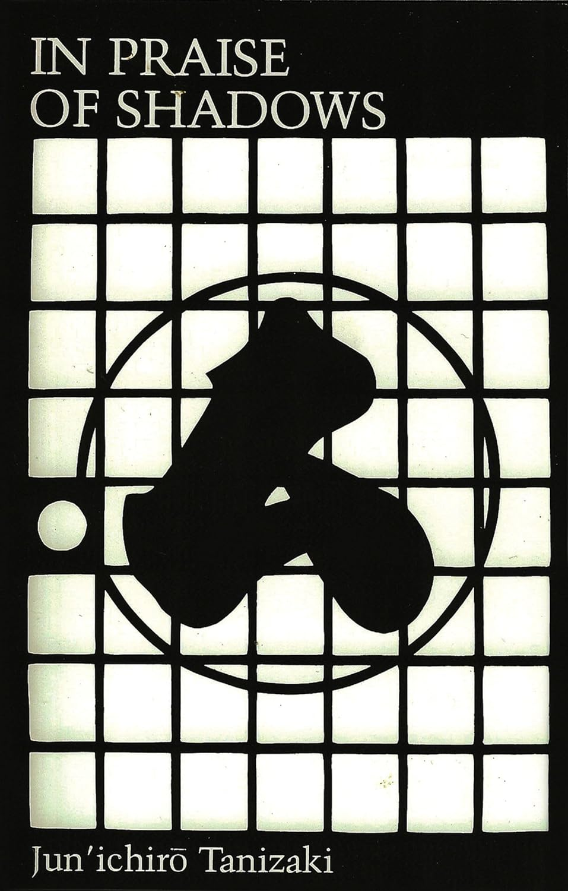
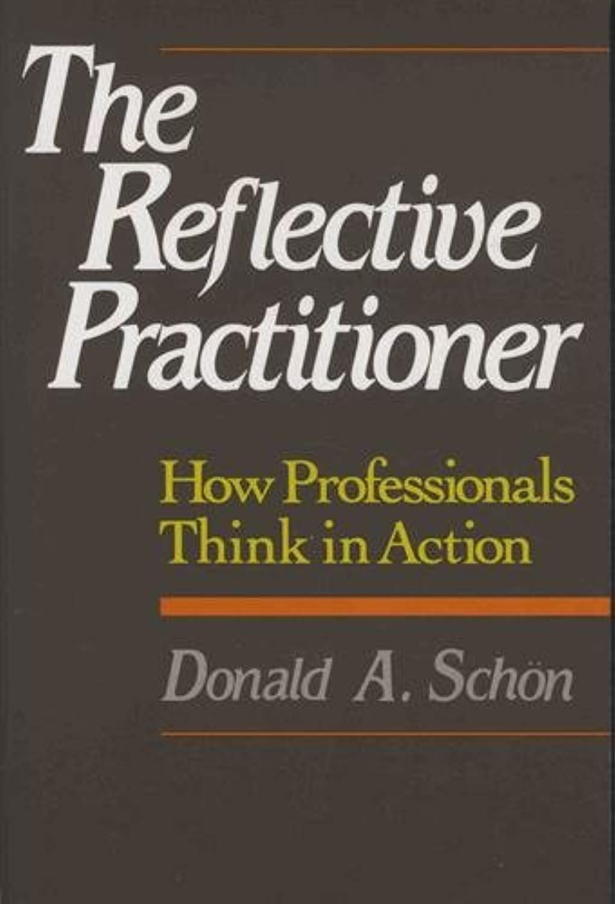
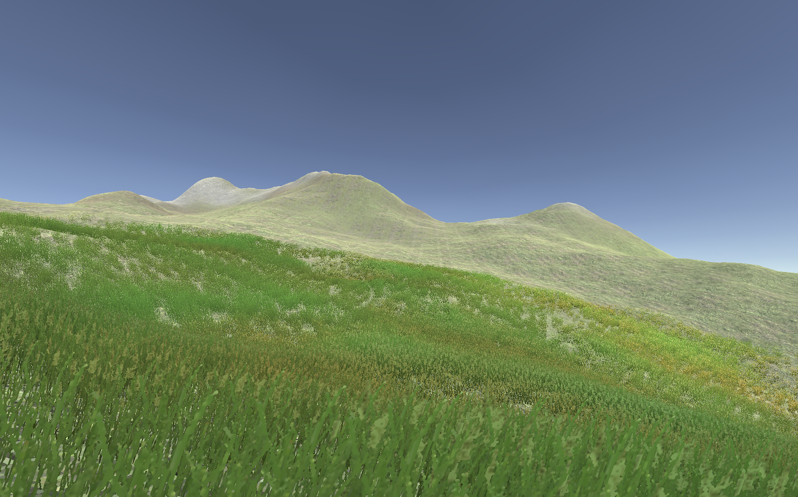

# In Praise of Shadows: Reflections, Prototypes, and Other Traces of Design

## Introduction

Hi, I'm [Pippin Barr](https://pippinbarr.com), an experimental game designer and a professor of Computation Arts at Concordia University.

I'm part of the [Games as Research](https://gamesasresearch.com) project to figure out how to document the game design process.

I wrote a book using the approaches to documentation we're researching! It wouldn't have been possible any other way. It's called [The Stuff Games Are Made Of](https://mitpress.mit.edu/9780262546119/the-stuff-games-are-made-of/).

So, I'm going to talk about the [Method for Design Materialization (MDM)](https://direct.mit.edu/desi/article-abstract/39/1/55/114217/Generative-Logics-and-Conceptual-Clicks-A-Case?redirectedFrom=fulltext), which is our Big Idea.

And I'll tell the story of my newest game [*v r 5*](https://pippinbarr.com/v-r-5/info) through the process documentation to show you how it all works.

## In Praise of Shadows

### The book

*v r 5* was inspired by the book [In Praise of Shadows by Jun'ichirō Tanizaki](https://en.wikipedia.org/wiki/In_Praise_of_Shadows). Especially Tanizaki's writing about [the nuances and categories of shadows](https://en.wikipedia.org/wiki/In_Praise_of_Shadows?useskin=vector#:~:text=In%20addition%20to%20contrasting%20light%20and%20dark%2C%20Tanizaki%20further%20considers%20the%20layered%20tones%20of%20various%20kinds%20of%20shadows%20and%20their%20power%20to%20reflect%20low%20sheen%20materials%20like%20gold%20embroidery%2C%20patina%20and%20cloudy%20crystals.%20In%20addition%2C%20he%20distinguishes%20between%20the%20values%20of%20gleam%20and%20shine.).

> *Artisans of old, when they finished their works in lacquer and decorated them in sparkling patterns, must surely have had in mind dark rooms and sought to turn to good effect what feeble light there was. Their extravagant use of gold, too, I should imagine, came of understanding how it gleams forth from out of the darkness and reflects the lamplight.*
>
> -- Jun'ichirō Tanizaki, *In Praise of Shadows*

### The *v r* series

The *v r* series in general is part of my (long) history of making work that surfaces the technical underpinnings of games, such as

- [*v r 1*](https://pippinbarr.com/v-r-1/info/) (about architecture),
- [*v r 2*](https://pippinbarr.com/v-r-2/info/) (about Unity Game Objects),
- [*v r 3*](https://pippinbarr.com/v-r-3/info/) (about water), and
- [*v r $4.99*](https://pippinbarr.com/v-r-4-99/info/) (about the Asset Store).

### The next one

And so I continued with a plan to examine [*shadows* in the Unity game engine](https://docs.unity3d.com/Manual/Shadows.html), and to make them available for contemplation.

Long story short, [I finished it](https://pippinbarr.com/v-r-5/webgl/).

But I'm not here to make the long story short. It's opposite day!

Rather, I want to show you four key design (process) themes that made *v r 5* what it became, using the MDM to illustrate them.

## The MDM and Design Reflection

### The Reflective Practitioner

The MDM draws heavily on the work of [Donald Schön](https://hci.stanford.edu/publications/bds/9-schon.html) and his understanding of design as a *reflective conversation with materials*.

> *As you work a problem, you are continually in the process of developing a path into it, forming new appreciations and understandings as you make new moves.*
>
> -- [Donald Schön interviewed by John Bennett in Bringing Design to Software](https://hci.stanford.edu/publications/bds/9-schon.html#:~:text=and%20the%20outcome.-,As%20you%20work%20a%20problem%2C%20you%20are%20continually%20in%20the%20process%20of%20developing%20a%20path%20into%20it%2C%20forming%20new%20appreciations%20and%20understandings%20as%20you%20make%20new%20moves.,-The%20designer%20evaluates)

So, how can we keep track of and make visible this process of developing a path?

There are plenty of answers, like "a documentary!" or "a reality TV show!" but some of us come from a computer science background, so our answer was

*Version control*!

### Version control?

At the heart of the MDM is the realization that we can use the traditional software-engineering technology of version control to track, archive, and understand the design process.

At heart, version control is about maintaining a history of all significant changes to a software project.

Normally, this means tracking traditional software development, like say a [popular game development framework for JavaScript](https://github.com/phaserjs/phaser).

You can see all the files just like on a computer, but you can *also* see the [entire history of changes in a series of *commit messages*](https://github.com/phaserjs/phaser/commits/master/).

Each time the developer does something significant to the project, they [*commit* the work and write a short message about what they did](https://github.com/phaserjs/phaser/commit/4df43d7bed035ec21dfc7832c2be458fe01e2855).

And so you end up being able to see every technical change to this long term project, timestamped, and with a brief description of what was done (and sometimes why it was done).

### Version control for design?

The central insight of MDM is to use the super-powered *record keeping* of version control.

But instead of terse, all-business descriptions of work, we focus on using verson control to keep track of *design reflection*, to record the ongoing *conversation with materials* of a reflective practitioner, to *document their trajectory through design space*.

We have a two really central best practice elements involved in this:

1. Maintaining a [*design process journal*](https://pippinbarr.com/v-r-5/process/journal.html) inside the project repository that contains regularly updated reflective design thinking
2. Writing a [*reflective commit message*](https://github.com/pippinbarr/v-r-5/commit/101685cef91aa161ae551ed644d40346a180fabb) every time we make a significant change to the project

These two practices alone allow us to then tell an incredible detailed story of the design process, to provide *empirical evidence* of design that is generally otherwise lost in the mists of time.

So, let's explore some of those moments in *v r 5* so I can show you what I mean...

## In the beginning

Every project starts somewhere, and in the MDM we encourage designers to start a repository *immediately*, not to wait until they have something "worth seeing."

For *v r 5* this means we have [a commit of an early sketch and reflection](https://github.com/pippinbarr/v-r-5/commit/9647a77283462ad2276a6d6476ee667c0c720cd9).

And the sketch itself exists [directly in the repository itself](https://github.com/pippinbarr/v-r-5/blob/9647a77283462ad2276a6d6476ee667c0c720cd9/process/pdfs/2023-08-15.pdf).

This was quickly followed a couple of days later by setting up a Unity project, yielding [a journal entry on the subject](https://pippinbarr.com/v-r-5/process/journal.html#:~:text=Well%2C%20one%20of%20the%20big%20things%20is%20just%20opening%20Unity%20and%20I%20can%20at%20least%20claim%20to%20have%20done%20that%20over%20today.%20I%20created%20a%20Unity%20project%20in%20the%20most%20recent%20LTS%20version%20(2022.3.7f1%20LTS%20for%20the%20record)%2C%20made%20a%20cube%2C%20and%20built%20it%20for%20WebGL%20so%20that%20there%E2%80%99s%20something%20to%20see.).

Crucially, though, thanks to - you guessed it - *version control*, we don't just get the reflective journal entry.

We also get [the entire file system of the *project* at the moment in time](https://github.com/pippinbarr/v-r-5/tree/24d9d5cb414cfa003800e3f5627e28ba30afc181).

And because of that, we have the *game itself* as it was when those reflections were written. Software being made of files. Behold its majesty:

And we don't just have a screenshot, we can straightforwardly [*run the game itself*](./builds/in-the-beginning/24d9d5cb414cfa003800e3f5627e28ba30afc181/) as it was then.

(Admittedly it's a lot like a screenshot with a loading screen.)

The MDM means we know what the designer was *thinking* and what they were *seeing* and what they were *doing*, even for the simplest, earliest moments of design.

## Landscaping

A key early concept in the project was to present the shadows of the Unity game engine in a naturalistic setting. Remembering "the island" cited in that very first sketch, I tried the obvious shortcut:

> *Specifically, I’ve been interested in setting up v r 5’s buildings and shadows on an island. So I grabbed a (the only easy to find) free island from the Unity asset store: Free Island Collection by Bicameral Studios.*  
> -- [Process journal, 21 August 2023](https://pippinbarr.com/v-r-5/process/journal.html#:~:text=Specifically%2C%20I%E2%80%99ve%20been%20interested%20in%20setting%20up%20v%20r%205%E2%80%99s%20buildings%20and%20shadows%20on%20an%20island.%20So%20I%20grabbed%20a%20(the%20only%20easy%20to%20find)%20free%20island%20from%20the%20Unity%20asset%20store%3A%20Free%20Island%20Collection%20by%20Bicameral%20Studios.)

For some reason I didn't link to the asset store, but [these are the islands I'm talking about](https://assetstore.unity.com/packages/3d/environments/landscapes/free-island-collection-104753):

But! Herein lies a tale of woe specifically around realism and beauty versus file sizes and my requirement to make this project work as a website. [It turns out that fancy islands eat a lot of disk space](https://pippinbarr.com/v-r-5/process/journal.html#:~:text=These%20are%20some,just%20too%20big.).

After fighting the woe for a while, I ended up going back to basics by "painting" my own horrible island, ending up with this:

  
([*Playable build*](./builds/landscaping/c953f3ca715f113539cd21c311d658bec077e1b3/))

For all that this is amateur hour, note how much this *does feel like something now*. We have a character controller, a place, a... vibe?

And crucially, from the perspective of design research, this odd early version of the game world *still exists* for contemplation.

But still, I was not happy with it.

> *My next step I think is to regrab the island and either retexture it with my downsampled textures (I hope this is doable as it would be the easier option) or export the height map and retexture is manually (I hope I don’t have to do this).*  
> -- [Process journal, 21 August 2023](https://pippinbarr.com/v-r-5/process/journal.html#:~:text=My%20next%20step%20I%20think%20is%20to%20regrab%20the%20island%20and%20either%20retexture%20it%20with%20my%20downsampled%20textures%20(I%20hope%20this%20is%20doable%20as%20it%20would%20be%20the%20easier%20option)%20or%20export%20the%20height%20map%20and%20retexture%20is%20manually%20(I%20hope%20I%20don%E2%80%99t%20have%20to%20do%20this).)

But eventually, after [endless downsampling of textures](https://github.com/pippinbarr/v-r-5/commits/main/?after=803e99c42231af1bfbfcea1f637b3377a399fe1b+139#:~:text=4f66ea8-,Working%20on%20textures,-pippinbarr) and [starting over](https://github.com/pippinbarr/v-r-5/commits/main/?after=803e99c42231af1bfbfcea1f637b3377a399fe1b+139#:~:text=Working%20on%20a%20fresh%20island) and [discovering the point-filter texture setting](https://github.com/pippinbarr/v-r-5/commits/main/?after=803e99c42231af1bfbfcea1f637b3377a399fe1b+139#:~:text=Changes%20to%20point%2Dbased%20filter%20on%20textures) I... well I restarted again in the endless building and washing away of these design sandcastles.

> *So the situation is that I’m starting my island “from scratch”*  
> -- [Process journal, 5 September 2023](https://pippinbarr.com/v-r-5/process/journal.html#:~:text=So%20the%20situation%20is%20that%20I%E2%80%99m%20starting%20my%20island%20%E2%80%9Cfrom%20scratch%E2%80%9D)

And a lot of learning later:

  
([*Playable build*](./builds/landscaping/d78d7f7203a381cc388129d9fa1ec981c7d9ce38/))

I was getting somewhere. I was making somewhere. And then...

... then there was the grass.

> *Spent my time this morning on the grass details which are a key way to add some visual noise that drowns out the repeating textures among other things.*  
> -- [Process journal, 6 September 2023](https://pippinbarr.com/v-r-5/process/journal.html#:~:text=Spent%20my%20time%20this%20morning%20on%20the%20grass%20details%20which%20are%20a%20key%20way%20to%20add%20some%20visual%20noise%20that%20drowns%20out%20the%20repeating%20textures%20among%20other%20things.)

And it was so green!

  

Too green actually, so I toned it down.

  

And eventually, somehow, after all the restarts, all the laborious texturing and grassing the whole island, I had something presentable.

> *So there’s still a little bit of work remaining here, but the island is starting to look kind of how I want, which would mean I could start construction, haha, but yeah construction.*  
> -- [Process journal, 6 September 2023](https://pippinbarr.com/v-r-5/process/journal.html#:~:text=So%20there%E2%80%99s%20still%20a%20little%20bit%20of%20work%20remaining%20here%2C%20but%20the%20island%20is%20starting%20to%20look%20kind%20of%20how%20I%20want%2C%20which%20would%20mean%20I%20could%20start%20construction%2C%20haha%2C%20but%20yeah%20construction.)

  
([*Playable build*](./builds/landscaping/8d555c196dc769e75ca8e9637d6ceba086768f08/))

All this in a game ostensibly about walking into rooms to view *shadows*?

> *So I suppose I want to say here that it has been very generative spending some time with the terrain even though my initial thought had been “grab an island as is and chuck stuff on”. I’ve enjoyed learning the tool, it’s been very satisfying building something “of my own” (with inherited components from the Unity Store Asset), and there’s a lot of “shadow stuff” involved that I might not have realized so easily otherwise.*  
> -- [Process journal, 12 September 2023](https://pippinbarr.com/v-r-5/process/journal.html#:~:text=So%20I%20suppose,so%20easily%20otherwise.)

When you play the final version of *v r 5*, the island more or less just looks like an island. It looks intentional. It looks like that's what I wanted. But through this design documentation we can see that wasn't the case at all.

It was a series of hard-won moves made in design space, awkward conversations with materials, and a consistent, overriding desire to have a *place* to work in.

## My Architect(ure)

> *How involved in architecture do I want to get? Some of this process is reminding me of the Quist chapter in The Reflective Practitioner in terms of all the complexities and expertise of architects - the site and all that. I want this thing to look... well nice and intentional, but I don’t want to labour TOO hard on that effect, so simplicity will be key.*  
> -- Famous last words, [Process journal, 23 August 2023](https://pippinbarr.com/v-r-5/process/journal.html#:~:text=How%20involved%20in,will%20be%20key.)

Pretty early on I nailed down a specific room shape I thought would make sense, thinking literally in terms of a folded structure that would reduce outside light.

  
[*Room layout sketch*](https://github.com/pippinbarr/v-r-5/blob/main/process/pdfs/2023-09-08-v-r-5.pdf)

Eventually I actually bit the bullet and made a room...

  
([*Playable build*](./builds/architecture/e6fb07bcc920321c35c34c2fc011284fce66d4ed/))

... it looked pretty bad, but at the time I was convinced I was above such things.

I was not.

> *Ran into that all-time classic pain in the ass shadow acne and other shadow artifaces that are just part of life with shadows.*  
> -- [Commit 5bb5585](https://github.com/pippinbarr/v-r-5/commit/5bb5585f13ef9a4d0d86a08568672c3599a8366a#:~:text=Ran%20into%20that%20all%2Dtime%20classic%20pain%20in%20the%20ass%20shadow%20acne%20and%20other%20shadow%20artifaces%20that%20are%20just%20part%20of%20life%20with%20shadows.)

  
([*Playable build*](./builds/architecture/5bb5585f13ef9a4d0d86a08568672c3599a8366a/))

No no no, I wanted to have *control*. Was I not like a god unto this island?

> *it does still have the issue of looking completely insane shadow-acne wise from specific distances and angles, something new to think about (I want to solve it for outdoor scenes but I'm interested in preserving/provoking at least in some interiors to "show it off"*  
> -- [Commit e966973](https://github.com/pippinbarr/v-r-5/commit/e9669739dd8260efa1dfbdffc90a302c2b80d76a#:~:text=it%20*does*%20still%20have%20the%20issue%20of%20looking%20completely%20insane%20shadow%2Dacne%20wise%20from%20specific%20distances%20and%20angles)

  
([*Playable build*](./builds/architecture/e9669739dd8260efa1dfbdffc90a302c2b80d76a/Build/))

So, no, apparently apparently I was *not* a god unto this island. All of which led to [this very intense technical confrontation with Unity and how it works (and doesn't work) in terms of shadows](https://pippinbarr.com/v-r-5/process/journal.html#:~:text=Things%20I%20have%20looked%20into%20at%20some%20level%20as%20a%20potential%20help%20when%20trying%20to%20understand%20how%20to%20make%20webgl%20look%20alright%20(haven%E2%80%99t%20tried%20all%20of%20these%2C%20it%E2%80%99s%20ongoing)%E2%80%A6).

I won't belabour this point too much further, but this went on... well it felt like forever:

  
  
  
  
  
  
  
  
  
  
  
  
  
  
  
  
  
  
  
  
  

And yet, in some ways it feels like this *had to happen*. Pity the poor formalist, labouring endlessly on his brutalist miniatures when he doesn't even know how to pour concrete.

Sometimes game making is a bit like that thing of making a croissant by milling your own wheat.

Sometimes brutalist, formalist undertakings are shot through with agony and mistakes and redos and... well, that's kind of nice?

## Moments that gleamed in the dark

But there's always a counterpoint. There were key moments across the development of the game that helped me to keep my faith that this was worthwhile, that essentially reconnected me to the "In Praise" mode of thinking.

Early on, this was "The First Dark Room":

> *Finally managed to get over one ProBuilder hump in order to constract a testing chamber for dark/controlled environments. So I now have a room in the shape I'd envisaged (a space where you do a little turnabout to get in to reduce infiltration of outside lighting) and a point light and a cube in there to check out the shadow casting.*  
> -- [Commit e6fb07b](https://github.com/pippinbarr/v-r-5/commit/e6fb07bcc920321c35c34c2fc011284fce66d4ed)

  
([*Playable build*](./builds/architecture/e6fb07bcc920321c35c34c2fc011284fce66d4ed/))

And I thought...

> *This is going to work*  
> -- [Process Journal, 11 September 2023](https://pippinbarr.com/v-r-5/process/journal.html#:~:text=Really%20love%20the,going%20to%20work)

The next gleam happened when I made the basic point light setup a touch more sophisticated...

> *I moved the current iteration of the exhibiting room  onto an actual space on the island, put in a point light, and a cube, and had it cast a shadow into the corner, which creates quite a nice form in the interaction between the shadow and the corner's structure. In doing it I realized I think I do want a "physical" representative of the light, so I put the light inside a small luminous sphere (to symbolize point lighting) and I do think that helps make the scene more legible.*  
> -- [Commit 023a072](https://github.com/pippinbarr/v-r-5/commit/023a072201b4962d331fb5849fe93a0723b2e614)

  
([*Playable build*](./builds/gleams/023a072201b4962d331fb5849fe93a0723b2e614/))

Things were starting to feel... kind of beautiful?

And then came the moment where I tried out a vase with a gold material applied to it and it just unlocked so much for me, including the basic tribute to the original essay.

> *Should every vase be gold? Probably the answer is yes and I should still create an "alcove version" where there's not much light but just enough to catch the glimmer etc. Can contruct some kind of alcove thing (maybe even look at sources) for the main tribute... but I also like just having the vase everywhere as a repeat tribute to the gold in In Praise*  
> -- [Commit 9aac0ed](https://github.com/pippinbarr/v-r-5/commit/9aac0ede0336a0e828ad3a8fe5142816c6ae2409)

  
([*Playable build*](./builds/gleams/9aac0ede0336a0e828ad3a8fe5142816c6ae2409/))

And then, finally, and most beautiful to me, is the very literal tribute to *In Praise of Shadows*, which I installed quite close to the end.

> *Created the Title Room which shows the game title and subtitle and just contains a BARELY LIT vase on plinth to capture the idea of the glint of gold in the darkness, where the darkness IS shadow... which somehow never lands in my brain accurately? It's a cool point. Kewl point bro.*  
> -- [Commit ba2b7c8](https://github.com/pippinbarr/v-r-5/commit/ba2b7c88d75ec22ab0d315b05f67a1b1acc8452a)

  
([*Playable build*](https://pippinbarr.com/v-r-5/webgl/))

And which I almost *ruined* with... A FLASHLIGHT???

😅

But in the end, these moments of beauty did gleam out at me, and we have records of those moments, to go with and explain their inevitable presence in the final game itself.

## And Other Traces of Design

There is a lot more to say and show about just how much process was captured using MDM with *v r 5*. More than there's really time to get into, but just so you know there's also...

- The [Why?s](https://pippinbarr.com/v-r-5/process/why.html) that progressively try to capture what the point of the project is
- The [To-do list](https://pippinbarr.com/v-r-5/process/to-do.html) that helps to describe concrete tasks and [responses to those tasks](https://pippinbarr.com/v-r-5/process/to-do.html#:~:text=But%20in%20practice%20it%20was%20less%20than%20amazing.%20Gigantic%20sun%2Dcast%20shadow%20against%20a%20mega%2Dplane%20that%20captures%20the%20island%20in%20profile%3F%20Kind%20of%20amazing%20in%20principle)
- The [List of Works](https://pippinbarr.com/v-r-5/process/list-of-works.html) where I put on the curator hat to figure out what exhibits would be on the island
- The [code itself](https://github.com/pippinbarr/v-r-5/blob/main/_unity-project/v-r-5/Assets/Scripts/Behaviours/FlickerBehaviour.cs) that could be the object of a software studies approach
- My colleague Enric Llagostera's analysis tool [Ponte](https://github.com/enricllagostera/ponte/) which helps visualize a project's chronology and export data from the repository to QDA software
- The *Being John Malkovich* Effect, as yet underexplored, of having anyone be able to sit in front of *exactly the same Unity project* as me, at any point in its history, having read my notes, etc.
- [This talk that I am giving right now](https://github.com/pippinbarr/v-r-5/tree/main/process/talks/talk.md) is in the repository [complete with its own commit history](https://github.com/pippinbarr/v-r-5/commits/main/process/talks/talk.md)
- ... and that's not to mention a number of other approaches we're investigating, including the technique of memoing from grounded theory, the use of voice notes, the question of how to track non-digital processes, and... more.

## Lest we forget

I *did actually finish this game*. Remember it from the beginning?

  
([*Playable build*](https://pippinbarr.com/v-r-5/webgl/))

And now you know, because you've seen the acne, heard the cries of agony, and felt the insanity building, that it's never as simple as it looks by the end.

## Well, thanks

This has been *In Praise of Shadows: Reflections, Prototypes, and Other Traces of Design*, a talk by Pippin Barr, who can be reached at

> <pippin.barr@concordia.ca>

and generally tracked via

> [pippinbarr.com](https://pippinbarr.com)

or asked questions now or later as you wish.

## 🤡
