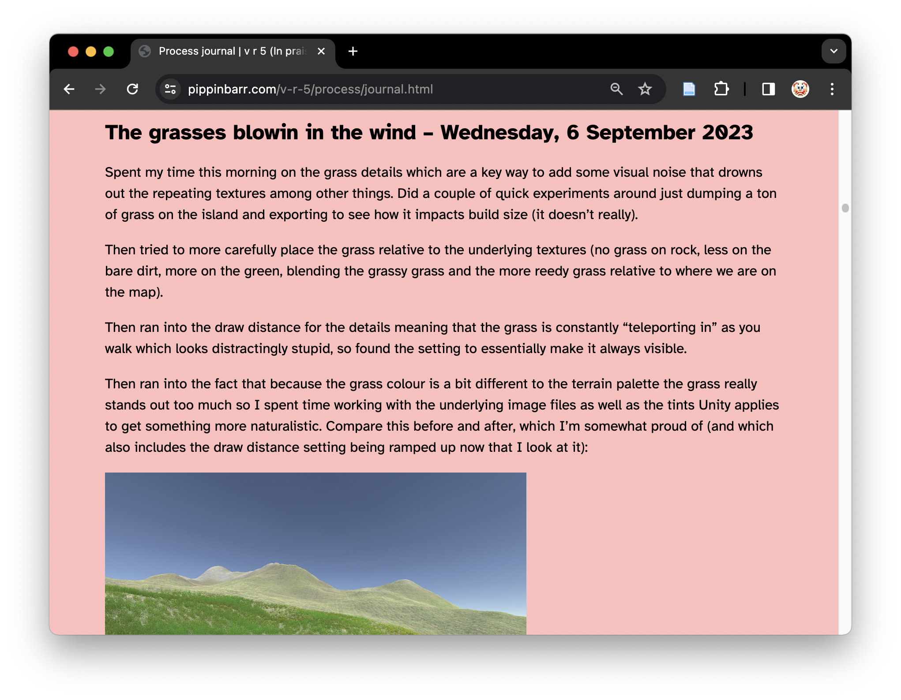

# In Praise of Shadows: Reflections, Prototypes, and Other Traces of Design

## Introduction

Hi, I'm [Pippin Barr](https://pippinbarr.com), an experimental game designer and a professor of Computation Arts at Concordia University.

I'm part of the [Games as Research](https://gamesasresearch.com) project to figure out how to document the game design process.

I wrote a book using the approaches to documentation we're researching! It wouldn't have been possible any other way. It's called [The Stuff Games Are Made Of](https://mitpress.mit.edu/9780262546119/the-stuff-games-are-made-of/).

So, I'm going to talk about the [Method for Design Materialization (MDM)](https://direct.mit.edu/desi/article-abstract/39/1/55/114217/Generative-Logics-and-Conceptual-Clicks-A-Case?redirectedFrom=fulltext), which is our Big Idea.

And I'll tell the story of my newest game [*v r 5*](https://pippinbarr.com/v-r-5/info) through the process documentation to show you how it all works.

## In Praise of Shadows

### The book

*v r 5* was inspired by the book [In Praise of Shadows by Jun'ichirō Tanizaki](https://en.wikipedia.org/wiki/In_Praise_of_Shadows). Especially Tanizaki's writing about [the nuances and categories of shadows](https://en.wikipedia.org/wiki/In_Praise_of_Shadows?useskin=vector#:~:text=In%20addition%20to%20contrasting%20light%20and%20dark%2C%20Tanizaki%20further%20considers%20the%20layered%20tones%20of%20various%20kinds%20of%20shadows%20and%20their%20power%20to%20reflect%20low%20sheen%20materials%20like%20gold%20embroidery%2C%20patina%20and%20cloudy%20crystals.%20In%20addition%2C%20he%20distinguishes%20between%20the%20values%20of%20gleam%20and%20shine.).

> *Artisans of old, when they finished their works in lacquer and decorated them in sparkling patterns, must surely have had in mind dark rooms and sought to turn to good effect what feeble light there was. Their extravagant use of gold, too, I should imagine, came of understanding how it gleams forth from out of the darkness and reflects the lamplight.*
>
> -- Jun'ichirō Tanizaki, *In Praise of Shadows*

### The *v r* series

The *v r* series in general is part of my (long) history of making work that surfaces the technical underpinnings of games, such as

- [*v r 1*](https://pippinbarr.com/v-r-1/info/) (about architecture),
- [*v r 2*](https://pippinbarr.com/v-r-2/info/) (about Unity Game Objects),
- [*v r 3*](https://pippinbarr.com/v-r-3/info/) (about water), and
- [*v r $4.99*](https://pippinbarr.com/v-r-4-99/info/) (about the Asset Store).

### The next one

And so I continued with a plan to examine [*shadows* in the Unity game engine](https://docs.unity3d.com/Manual/Shadows.html), and to make them available for contemplation.

Long story short, [I finished it](https://pippinbarr.com/v-r-5/webgl/).

But I'm not here to make the long story short. It's opposite day!

Rather, I want to show you five key design (process) themes that made *v r 5* what it became, using the MDM to illustrate them.

## The MDM and Design Reflection

### The Reflective Practitioner

The MDM draws heavily on the work of [Donald Schön](https://hci.stanford.edu/publications/bds/9-schon.html) and his understanding of design as a *reflective conversation with materials*.

> *As you work a problem, you are continually in the process of developing a path into it, forming new appreciations and understandings as you make new moves.*
>
> -- [Donald Schön interviewed by John Bennett in Bringing Design to Software](https://hci.stanford.edu/publications/bds/9-schon.html#:~:text=and%20the%20outcome.-,As%20you%20work%20a%20problem%2C%20you%20are%20continually%20in%20the%20process%20of%20developing%20a%20path%20into%20it%2C%20forming%20new%20appreciations%20and%20understandings%20as%20you%20make%20new%20moves.,-The%20designer%20evaluates)

So, how can we keep track of and make visible this process of developing a path?

There are plenty of answers, like "a diary!" or "a reality TV show!" but some of us come from a computer science background, so our answer was

*Version control*!

### Version control?

At the heart of the MDM is the realization that we can use the traditional software-engineering technology of version control to track, archive, and understand the design process.

At heart, version control is about maintaining a history of all significant changes to a software project.

Normally, this means tracking traditional software development, like say a [popular game development framework for JavaScript](https://github.com/phaserjs/phaser).

You can see all the files just like on a computer, but you can *also* see the [entire history of changes in a series of *commit messages*](https://github.com/phaserjs/phaser/commits/master/).

Each time the developer does something significant to the project, they [*commit* the work and write a short message about what they did](https://github.com/phaserjs/phaser/commit/4df43d7bed035ec21dfc7832c2be458fe01e2855).

And so you end up being able to see every technical change to this long term project, timestamped, and with a brief description of what was done (and sometimes why it was done).

### Version control for design?

The central insight of MDM is to use the super-powered *record keeping* of version control.

But instead of terse, all-business descriptions of work, we focus on using verson control to keep track of *design reflection*, to record the ongoing *conversation with materials* of a reflective practitioner, to *document their trajectory through design space*.

We have a two really central best practice elements involved in this:

1. Maintaining a [*design process journal*](https://pippinbarr.com/v-r-5/process/journal.html) inside the project repository that contains regularly updated reflective design thinking
2. Writing a [*reflective commit message*](https://github.com/pippinbarr/v-r-5/commit/101685cef91aa161ae551ed644d40346a180fabb) every time we make a significant change to the project

These two practices alone allow us to then tell an incredible detailed story of the design process, to provide *empirical evidence* of design that is generally otherwise lost in the mists of time.

So, let's explore some of those moments in *v r 5* so I can show you what I mean...

## In the beginning

Every project starts somewhere, and in the MDM we encourage designers to start a repository *immediately*, not to wait until they have something "worth seeing."

For *v r 5* this means we have [a commit of an early sketch and reflection](https://github.com/pippinbarr/v-r-5/commit/9647a77283462ad2276a6d6476ee667c0c720cd9).

And the sketch itself can be viewed [via the process journal](https://pippinbarr.com/v-r-5/process/journal.html#:~:text=Initial%20notebook%20sketches,about%20the%20game.) or [directly in the repository itself](https://github.com/pippinbarr/v-r-5/blob/9647a77283462ad2276a6d6476ee667c0c720cd9/process/pdfs/2023-08-15.pdf).

This is quickly followed a couple of days later by setting up a Unity project, yielding [a journal entry on the subject](https://pippinbarr.com/v-r-5/process/journal.html#:~:text=Well%2C%20one%20of%20the%20big%20things%20is%20just%20opening%20Unity%20and%20I%20can%20at%20least%20claim%20to%20have%20done%20that%20over%20today.%20I%20created%20a%20Unity%20project%20in%20the%20most%20recent%20LTS%20version%20(2022.3.7f1%20LTS%20for%20the%20record)%2C%20made%20a%20cube%2C%20and%20built%20it%20for%20WebGL%20so%20that%20there%E2%80%99s%20something%20to%20see.).

Crucially, though, thanks to - you guessed it - *version control*, we don't just get the reflective journal entry.

We also get [the entire file system of the *project* at the moment in time](https://github.com/pippinbarr/v-r-5/tree/24d9d5cb414cfa003800e3f5627e28ba30afc181).

And because of that, we can quite simply recover the *game itself* as it was when those reflections were written. Behold its majesty:

That's not just a screenshot, we can straightforwardly [*run the game itself*](./builds/in-the-beginning/24d9d5cb414cfa003800e3f5627e28ba30afc181/) as it was then.

So, the MDM means we know what the designer was *thinking* and what they were *seeing* and what they were *doing*, even for this perhaps "unimpressive" moment in design.

## Landscaping

A key early concept in the project was to present the shadows of the Unity game engine in a naturalistic setting:

> *Specifically, I’ve been interested in setting up v r 5’s buildings and shadows on an island. So I grabbed a (the only easy to find) free island from the Unity asset store: Free Island Collection by Bicameral Studios.*  
> -- [Process journal](https://pippinbarr.com/v-r-5/process/journal.html#:~:text=Specifically%2C%20I%E2%80%99ve%20been%20interested%20in%20setting%20up%20v%20r%205%E2%80%99s%20buildings%20and%20shadows%20on%20an%20island.%20So%20I%20grabbed%20a%20(the%20only%20easy%20to%20find)%20free%20island%20from%20the%20Unity%20asset%20store%3A%20Free%20Island%20Collection%20by%20Bicameral%20Studios.)

Therein lies a tale of woe specifically around file sizes and my requirement to make this project work as a website. [It turns out that fancy islands eat a lot of disk space](https://pippinbarr.com/v-r-5/process/journal.html#:~:text=These%20are%20some,just%20too%20big.).

After fighting the woe for a while, I ended up with this:

  
([*Playable build*](./builds/landscaping/c953f3ca715f113539cd21c311d658bec077e1b3/))

Note how much this *does feel like something now*. We have a character controller, a place, a... vibe?

But please marvel that this odd early experience of the game world *still exists* for contemplation.

> *My next step I think is to regrab the island and either retexture it with my downsampled textures (I hope this is doable as it would be the easier option) or export the height map and retexture is manually (I hope I don’t have to do this).*  
> -- [Process journal](https://pippinbarr.com/v-r-5/process/journal.html#:~:text=My%20next%20step%20I%20think%20is%20to%20regrab%20the%20island%20and%20either%20retexture%20it%20with%20my%20downsampled%20textures%20(I%20hope%20this%20is%20doable%20as%20it%20would%20be%20the%20easier%20option)%20or%20export%20the%20height%20map%20and%20retexture%20is%20manually%20(I%20hope%20I%20don%E2%80%99t%20have%20to%20do%20this).)

But eventually, after [endless downsampling of textures](https://github.com/pippinbarr/v-r-5/commits/main/?after=803e99c42231af1bfbfcea1f637b3377a399fe1b+139#:~:text=4f66ea8-,Working%20on%20textures,-pippinbarr) and [starting over](https://github.com/pippinbarr/v-r-5/commits/main/?after=803e99c42231af1bfbfcea1f637b3377a399fe1b+139#:~:text=Working%20on%20a%20fresh%20island) and [discovering the point-filter texture setting](https://github.com/pippinbarr/v-r-5/commits/main/?after=803e99c42231af1bfbfcea1f637b3377a399fe1b+139#:~:text=Changes%20to%20point%2Dbased%20filter%20on%20textures) I... well I restarted again in the endless building and washing away of these design sandcastles.

> *So the situation is that I’m starting my island “from scratch”*  
> -- [Process journal](https://pippinbarr.com/v-r-5/process/journal.html#:~:text=So%20the%20situation%20is%20that%20I%E2%80%99m%20starting%20my%20island%20%E2%80%9Cfrom%20scratch%E2%80%9D)

  
([*Playable build*](./builds/landscaping/d78d7f7203a381cc388129d9fa1ec981c7d9ce38/))

It was all pretty impossibly tiring, but eventually...

... there was the grass.

> *Spent my time this morning on the grass details which are a key way to add some visual noise that drowns out the repeating textures among other things.*  
> -- [Process journal](https://pippinbarr.com/v-r-5/process/journal.html#:~:text=Spent%20my%20time%20this%20morning%20on%20the%20grass%20details%20which%20are%20a%20key%20way%20to%20add%20some%20visual%20noise%20that%20drowns%20out%20the%20repeating%20textures%20among%20other%20things.)

And it was green!

  

Too green actually, so I toned it down.

  

And eventually, somehow, after texturing and grassing the whole island, I had something presentable.

> *So there’s still a little bit of work remaining here, but the island is starting to look kind of how I want, which would mean I could start construction, haha, but yeah construction.*  
> -- [Process journal](https://pippinbarr.com/v-r-5/process/journal.html#:~:text=So%20there%E2%80%99s%20still%20a%20little%20bit%20of%20work%20remaining%20here%2C%20but%20the%20island%20is%20starting%20to%20look%20kind%20of%20how%20I%20want%2C%20which%20would%20mean%20I%20could%20start%20construction%2C%20haha%2C%20but%20yeah%20construction.)

  
([*Playable build*](./builds/landscaping/8d555c196dc769e75ca8e9637d6ceba086768f08/))

All this in a game ostensibly about walking into rooms to view *shadows*?

> *So I suppose I want to say here that it has been very generative spending some time with the terrain even though my initial thought had been “grab an island as is and chuck stuff on”. I’ve enjoyed learning the tool, it’s been very satisfying building something “of my own” (with inherited components from the Unity Store Asset), and there’s a lot of “shadow stuff” involved that I might not have realized so easily otherwise.*  
> -- [Process journal](https://pippinbarr.com/v-r-5/process/journal.html#:~:text=So%20I%20suppose,so%20easily%20otherwise.)

## Architecture

## The stages of design grief and joy

## Decorative Arts

---
---

Ideally or often, a well-documented (research-creation) game would have a [public facing website](https://pippinbarr.com/v-r-5/info) that can provide layers of understanding of the project.

At the heart of the MDM is having a [process documentation component](https://pippinbarr.com/v-r-5/info/#:~:text=Documentation,the%20Code%20Repository) that you maintain during the life of the project and that is publicly visible.

We've come up with a few standard forms of documentation that we all try to adhere to as much as we can.

#### Why?s

The ["Why?" document](https://pippinbarr.com/v-r-5/process/why) serves as a place to iterate on the big questions and reasons for making the project all, to think about *what it is* or *what it should be*.

This helps with being accountable to an actual research objective in a research setting.

This helps to remind you of what on earth you are doing when you inevitably get lost in the weeds of really making the thing.

And so in the lifetime of a project you try to write [multiple](https://pippinbarr.com/v-r-5/process/why#v1--friday-25-august-2023), [different](https://pippinbarr.com/v-r-5/process/why#v2--thursday-5-october-2023), [versions](https://pippinbarr.com/v-r-5/process/why#v3--tuesday-30-january-2024), of [your why](https://pippinbarr.com/v-r-5/process/why#v4--thursday-21-march-2024).

#### Journal

One of the key rhythms of the MDM is design journaling: taking time to pause regularly (perhaps every week, or more often, or less) to reflect on the state of the project and what is on your mind.

You can and should do this as part of a (research-)creative practice anyway. I've been doing something like it with games [since around 2011](https://pippinbarr.com/the-artist-is-present/process/process-journal.html#simplicity-kills-2011-08-24).

And there are all kinds of different sketches, insights, affects, and stories you can include in there...

- [Early ideas in a notebook](https://github.com/pippinbarr/v-r-5/blob/main/process/pdfs/2023-08-15-v-r-5.pdf)
- [Pictorials of a specific design issue](https://pippinbarr.com/v-r-5/process/journal#the-shitties-and-gritties-of-terrain--monday-21-august-2023)
- [Taxonomizing the design space](https://pippinbarr.com/v-r-5/process/journal#taxonomizing-shadow-and-light-the-island-as-a-place-structures--thursday-24-august-2023)
- [Aesthetic victories](https://pippinbarr.com/v-r-5/process/journal#the-grasses-blowin-in-the-wind--wednesday-6-september-2023)
- [Architectural sketches](https://github.com/pippinbarr/v-r-5/blob/main/process/pdfs/2023-09-08-v-r-5.pdf)
- [Technical disasters](https://pippinbarr.com/v-r-5/process/journal#the-fight-continues-now-with-blender--tuesday-19-september-2023)
- [More technical disasters](https://pippinbarr.com/v-r-5/process/journal#fuck-you-webgl--settings-mania--thursday-21-september-2023)
- [Terrible realizations](https://pippinbarr.com/v-r-5/process/journal#the-zium-museum-prototype--wednesday-22-november-2023)
- [Feelings](https://pippinbarr.com/v-r-5/process/journal#:~:text=BUT%20I%20suppose%20there%E2%80%99s,as%20easily%20be%20wrong.)
- [Personal growth](https://pippinbarr.com/v-r-5/process/journal#:~:text=The%20continuing%20saga,feel%20more%20intimate.)
- [Little Big Moments](https://pippinbarr.com/v-r-5/process/journal#:~:text=The%20moment%20where%20I%20finally%20got%20the%20gold%20vase%20that%20changed%20my%20thinking%20about%20composition%20a%20lot.%20Isn%E2%80%99t%20it%20a%20beaut%3F)
- [Did I  mention technical disasters?](https://pippinbarr.com/v-r-5/process/journal#:~:text=For%20some%20reason%20and%20as%20some%20point%2C%20the%20shadows/illumination%20levels%20on%20the%20building%20itself%20(built%20in%20Blender)%20has%20become%20utterly%20fucked!%20Like%20big%20square%20patchs%20on%20the%20roof%20as%20an%20example%20(but%20it%E2%80%99s%20interior%20too)%3A)
- [Learning nothing?](https://pippinbarr.com/v-r-5/process/journal#:~:text=Which%E2%80%A6%20again%2C%20I%E2%80%99m,the%20action%20is.)
- [Retrospectives](https://pippinbarr.com/v-r-5/process/journal#:~:text=I%20continue%20to,more%20jokes.%20Haha.)
- [Swearing](https://pippinbarr.com/v-r-5/process/journal#:~:text=successful%20game.%20Nah.-,Writing%20another/final%20why,because%20I%20am%20a%20good%20boy%20who%20wants%20a%20dog%20biscuit.)

And, again, this is great because *anyone can (and should!) do it*, with or without a fancy documentation methodology.

#### Commits

And now for the grand reveal: *version control*.

At the heart of the MDM is the realization that we can use the traditional software-engineer technology of version control to track, archive, and understand the design process.

Normally, version control is about tracking traditional software development, like say a [popular game development framework for JavaScript](https://github.com/phaserjs/phaser).

You can see all the files just like on a computer, but you can *also* see the [entire history of changes in a series of *commit messages*](https://github.com/phaserjs/phaser/commits/master/).

Each time the developer does something significant to the project, they [*commit* the work and write a short message about what they did](https://github.com/phaserjs/phaser/commit/4df43d7bed035ec21dfc7832c2be458fe01e2855).

So what if we used those messages to reflect on the *design implications of the work done*? We'd have [a record of design as it happens in conjunction with technical practice](https://github.com/pippinbarr/v-r-5/commits/main/?after=4a69aaff9c3da12dc98eab2d6b6e87b50075fffd+34), things like:

- [The very beginning](https://github.com/pippinbarr/v-r-5/commit/9cd09cf3b4eab7605014cd4a9f7e9ac83473e77c)
- [Early technical progress](https://github.com/pippinbarr/v-r-5/commit/b9b5de295eabd74e44d18e019f5dd49bb3f31a3b)
- [Gardening](https://github.com/pippinbarr/v-r-5/commit/c16f58c258755bac1508329093d914d04976edac)
- [Architecting](https://github.com/pippinbarr/v-r-5/commit/e6fb07bcc920321c35c34c2fc011284fce66d4ed)
- [Technical lamentations](https://github.com/pippinbarr/v-r-5/commit/e669357f09a68eaf8651753b9ab545e41704d26c)
- [Darkness and confusion](https://github.com/pippinbarr/v-r-5/commit/861f53bcf27d1c61c95c735c162fede7eca5ddf9)
- [Working hard and being underwhelmed](https://github.com/pippinbarr/v-r-5/commit/7cee038c9fb6722bb87d0ac592308f9a3d6f3dd0)
- [Victories in the shadows](https://github.com/pippinbarr/v-r-5/commit/9aac0ede0336a0e828ad3a8fe5142816c6ae2409)
- [Sculpting](https://github.com/pippinbarr/v-r-5/commit/caeb485c055208fb33dc1cb09d0dcc39491bdf3e)
- [Audio engineering](https://github.com/pippinbarr/v-r-5/commit/101685cef91aa161ae551ed644d40346a180fabb)
- [Cartography](https://github.com/pippinbarr/v-r-5/commit/e80da0851cc620350093c55a2e568095c74b9a4a)

Now we have a complete linkage between technical practice, design thinking, and the *actual state of the project at that moment*. This is powerful.

## Prototypes

### Prototyping

And so, now for the *grander* reveal: a complete history of prototypes.

An understandably huge part of the game design process is the direct engagement with the materiality of the software under construction, the *prototypes* produced iteratively throughout the project.

### In Search of Lost Prototypes

The miracle of version control is not just that we get a time-sliced view of all the changes to the project, but also that we can *revisit any moment in the project's history*.

And in the context of the MDM, this means we have a complete association between the reflective design thinking in our whys, journal entries, and commit messages and *the project as it was at that moment*.

And so we can relive "that time when..."

- ... we were just getting started ([commit 9253994](https://github.com/pippinbarr/v-r-5/commit/b9b5de295eabd74e44d18e019f5dd49bb3f31a3b) / [playable build](./builds/9253994/))
- ... we were just so excited about grass ([commit c16f58c](https://github.com/pippinbarr/v-r-5/commit/c16f58c258755bac1508329093d914d04976edac) / [playable build](./builds/c16f58c/))
- ... we were so disappointed in ourselves ([commit 7cee038](https://github.com/pippinbarr/v-r-5/commit/7cee038c9fb6722bb87d0ac592308f9a3d6f3dd0) / [playable build](./builds/7cee038/))
- ... we got some real traction ([commit f65f2c9](https://github.com/pippinbarr/v-r-5/commit/f65f2c978ec6b564d77ace9c63aaf1e61c0bf411) / [playable build](./builds/f65f2c9/))
- ... we finally seemed to understand ([commit 2a4f838](https://github.com/pippinbarr/v-r-5/commit/2a4f838019fa96a77dd656b1852ec05e63fbfab3) / [playable build](./builds/2a4f838/))
- ... we remembered how important sound is, even in shadow ([commit cd57422](https://github.com/pippinbarr/v-r-5/commit/cd574220bc073ede193b0ff44b0425cb111d014a) / [playable build](./builds/cd57422/))

... those times when *everything happened*.

### Being John Malkovich

Stranger still, maybe almost mystical, is the fact that you can not only play the game in its myriade states, you can also look at it *through the eyes of the designer/developer*.

By loading all the files of a specific commit, you can fire up the project in Unity yourself, and see what I saw...

- ... while I was looking at Unity's equivalent of a blank page ("Initial commit of MDM Unity template," commit a9e3ff3), or
- ... while I was playing at horticulture ("Added grass details to the island", commit c16f58c), or
- ... while I was in the thick of exhibit installations ("Added window, orbiter, low quality, and others (webgl updated)
", commit 147cc79), or
- ... at any other time!

> "There is truth, and there are lies, and art always tells the truth. Even when it's lying."
>
> -- Craig Schwartz (in John Malkovich) in *Being John Malkovich*

## and Other Traces

But wait there's more! There's as much as you can handle, because in archiving the entire project in this timesliced way, there are all kinds of other documents and artifacts to look at, like:

- The [to-do list](https://pippinbarr.com/v-r-5/process/to-do.html) maintained across the project's lifetime
- The [curation document](https://pippinbarr.com/v-r-5/process/list-of-works.html) used to track the set of exhibits in the game
- The [specific code files](https://github.com/pippinbarr/v-r-5/blob/main/_unity-project/v-r-5/Assets/Scripts/Behaviours/FlickerBehaviour.cs) that drive the game's behaviour
- The various [3D, image, audio, and other assets](https://github.com/pippinbarr/v-r-5/tree/main/_unity-project/v-r-5/Assets) that populate the game

And then there are also the more overarching visualizations of the nature of the project, including [GitHub's own "pulse" tool](https://github.com/pippinbarr/v-r-5/pulse).

More importantly, there is Enric Llagostera's in development tool [Ponte](https://github.com/enricllagostera/ponte/), which is specifically made to convert MDM-based repositories into data fit for Qualitative Data Analysis software.

But which also has a fantastic timeline view which is amazing to scrub through (and in my case reminisce with).

(And of course [this talk is in the project repository as well](https://github.com/pippinbarr/v-r-5/blob/main/process/talks/talk.md)! It has its own [commit history](https://github.com/pippinbarr/v-r-5/commits/main/process/talks/talk.md)!)

## (New ways of thinking) of Design

### Here Comes Everything

### Wire-tapping the conversation with materials

### Tracing trajectories through design space

### De-monolithing design

### Developers as humans

### Malkovich Malkovich Malkovich

## Well, thanks

This was *In Praise of Shadows: Reflections, Prototypes, and Other Traces of Design*, a talk by Pippin Barr, who can be reached at

> <pippin.barr@concordia.ca>

and generally followed at

> [pippinbarr.com](https://pippinbarr.com)
